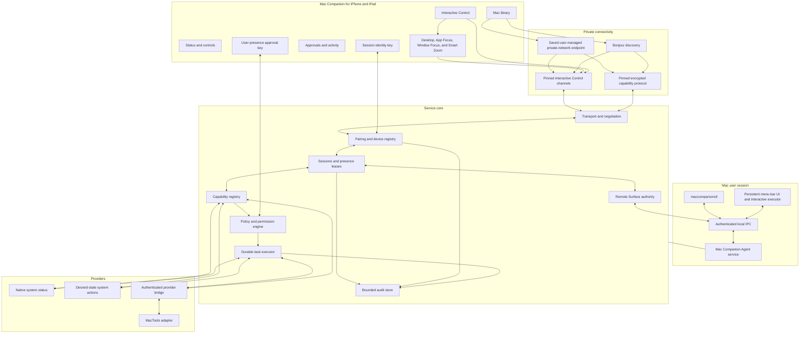
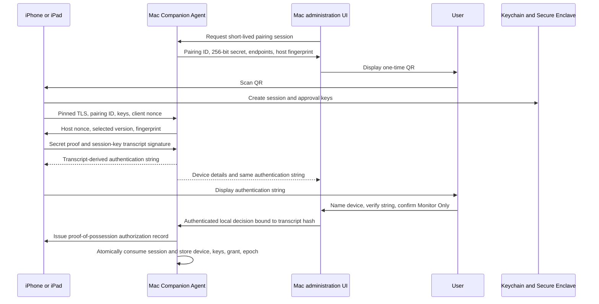

# Mac Companion Architecture

## System overview

## Deployment decision

The first service is a per-user LaunchAgent registered with `SMAppService.agent`. It starts after that user logs in, owns the listener and security state, and continues while the display is locked or a settings window is closed. The containing menu app also registers its login launch through `SMAppService.mainApp` or a Stage 0-proven equivalent so a visible indicator is restored after login.

The menu-bar app is a persistent status item while Mac Companion is enabled. It is the trusted local administration UI and owns ScreenCaptureKit capture, Accessibility observation, and post-event input. It does not own the long-lived network listener. If the menu app crashes, the LaunchAgent remains available for status and eligible semantic actions, immediately suspends Interactive Control, invokes only the Stage 0-approved recovery mechanism, and records the degraded state. Closing settings never hides or terminates the status item. An explicit local **Quit and Disable** action unregisters both login roles and is never treated as a crash to restore.

The user's enabled/disabled choice is a small durable containing-app record,
not an inference from running processes or `SMAppService` status. It is written
with a revision-fenced atomic replacement before live lifecycle mutation.
Startup loads it before constructing the Agent lifecycle; absence means
disabled, and process readiness is always rediscovered. Enabled eligible roles
restart at `starting`, never `ready`. The signed composition
must reconcile the two login roles and live reducer to this record before
listener readiness. This preserves an enable request across partial
registration/start failure and makes disable the durable recovery direction
before remote teardown and role removal.

Process truth is generation-fenced independently for Agent and menu roles.
Boot-scoped lifecycle revision prevents stale compare-and-commit after an ABA
state sequence, while per-role epochs invalidate observations across enable,
disable, login/logout, and process exit without treating lock/unlock as a new
process. Registration, launch requests, service status, and PID presence never
mean ready. The signed Agent/bootstrap and authenticated menu IPC/process
sources activate exact generations; only their fresh ready observations advance
the reducer. Exact termination advances remote safety before the matching
recovery request, and stale generations cannot terminate or restart current
authority.

The concrete observation source root is created only from the complete
startup-reconciled `AgentPrimaryServicesV1` graph. Root construction is the
Agent self-ready signal. It issues a menu observation connection only after the
final adapter has authenticated and authorized that exact local connection;
the returned capability contains no caller role or identity claim. Connection
ready and invalidation serialize, duplicate generations are rejected, terminal
invalidation receipts replay exactly, and an old connection cannot affect its
replacement. Failed or ambiguous menu recovery starts enter one exact
revision/epoch-fenced three-attempt schedule at 250 milliseconds, 1 second, and
4 seconds. Replacement observation, disable/logout, any lifecycle revision or
role-epoch change, or success stops it; exhaustion never implies readiness and
leaves the truthful degraded state available to local status. This replay is
limited to the idempotent start request and cannot be used for semantic remote
operations. The raw audit-token/designated-requirement check and physical XPC
callbacks remain final-target responsibilities.

Explicit enablement is a compensated saga rather than one optimistic toggle.
The Agent prepares an exact compare-and-commit lifecycle transition; the
containing app converges Agent then menu login registration; the Agent commits
only if its lifecycle before-state is unchanged; and the containing app then
requests both process starts. A failed stale commit compensates both
registrations while intent remains disabled. Disable reverses the safety
ordering: the Agent commits disabled intent and completes remote teardown
before the containing app attempts both unregistrations. Cleanup failure cannot
reopen remote ingress, and same-desired-state retries reconverge postconditions.

For the first product:

- A logged-in user session is required.
- Locking the display does not stop the service.
- Logging out stops that user's service.
- Before login, after logout, and at a no-user login window, the host is unreachable.
- Sleeping hosts are unreachable until they wake.
- A locked display does not reveal the logged-in desktop. A physical-device spike may permit viewing and operating the genuine macOS lock screen; normal macOS authentication remains authoritative.
- A future boot-time daemon requires a separate design for identity storage, TCC, provider access, user ownership, and UI coordination; it is not an implied extension of the LaunchAgent.

The initial macOS product is distributed directly as a Developer ID-signed, hardened, notarized app under the Jenny Media LLC developer team. It targets the current stable macOS 26 line and is built with stable Xcode 26.6 and Swift 6.3; macOS 27 betas are compatibility targets, not deployment requirements. A Mac App Store build is not an MVP goal because Interactive Control and provider integration require capabilities that must be evaluated outside App Sandbox.

## Process responsibilities

### Mac Companion Agent

The LaunchAgent owns:

- Network listeners and Bonjour advertisement
- Host identity and paired-device records
- Per-device permission grants
- Session credentials and revocation state
- Capability and provider lifecycle
- Policy decisions
- Durable operation and idempotency records
- Presence leases
- Audit history and quotas

### Menu-bar app

The app owns trusted local presentation for:

- Pairing approval and verification
- Permission-profile changes
- Device revocation
- Active-session inspection and termination
- Remote-exposure configuration
- Activity and security history
- Local Network and other permission guidance
- Diagnostics and recovery
- Persistent active-viewing and active-control indication
- Screen Recording, Persistent Content Capture, and Accessibility readiness and guidance
- ScreenCaptureKit capture, H.264 encoding, and authorized mouse and keyboard execution
- Privacy-filtered application/window resolution, App Focus, Window Focus, Smart Zoom, and transient focus observation

If the UI is unavailable, the service retains its last approved configuration. New pairing approvals and permission elevation fail closed because there is no trusted local presentation surface. Interactive Control stops and cannot restart until the visible menu app and its authenticated IPC session return.

### Diagnostic CLI

`maccompanionctl` communicates through authenticated local IPC and uses the same policy, executor, and audit path as the app and network clients.

Initial responsibilities:

- Show the content-free Agent status snapshot.
- Export the bounded sanitized diagnostic snapshot and event page to standard
  output.
- Present local help and protocol version without contacting the Agent.

The bundle-independent [v0.1 CLI profile](../spec/local-cli/v0/README.md)
defines exact arguments, request plans, output, and fixed exit semantics. The
signed executable and XPC adapter remain final-identity artifacts. Endpoint
details, provider/capability lists, paired-device or session administration,
revocation, session termination, event tailing, manifest/fixture validation,
and test-action invocation are future candidates only. They remain denied until
the local IPC method matrix adds a separately reviewed authenticated operation;
the CLI must not approximate them from files, processes, sockets, or remote
protocol calls.

The service validates the connecting process using platform credentials such as the XPC audit token and an expected code-signing requirement. Filesystem path or same-user execution alone is not authentication. Administrative CLI operations are separately authorized and audited.

## Networking

### Discovery and permission

The service advertises exactly `_maccompanion._tcp` in `local.`. The iOS app browses only that type. Both products include clear Local Network usage descriptions and explicit denied/restricted recovery UI.

Bonjour provides endpoint discovery, not identity. The v0.1 TXT record is closed to `v=0` and `h=<first eight fingerprint bytes as 16 lowercase hexadecimal characters>`; it contains no host name, device name, user name, addresses, capabilities, or secrets. The hint is untrusted and only helps correlate candidates before the full pinned fingerprint is verified. Clients treat all discovery metadata as hostile until the pinned secure session succeeds.

The v0.1 Agent listens on TCP port `59653` in the dynamic/private range. A
bind conflict fails startup closed; the product does not silently choose a new
port because saved user-managed private routes must remain deterministic.

### Endpoint identity

The host creates a long-lived signing identity on first setup. Pairing pins that identity independently of hostname, IP address, Bonjour instance name, or Tailscale machine name.

A paired host can therefore be reached through:

- A resolved Bonjour endpoint
- A saved Tailscale MagicDNS name
- A saved private IPv4 or IPv6 address
- Another user-managed private route that exposes a stable IP or DNS endpoint

Changing an endpoint does not change host identity. Changing or losing the host identity requires an explicit recovery or re-pairing flow.

The v0.1 identity profile freezes a Secure Enclave P-256 key, exact DER SubjectPublicKeyInfo fingerprint, same-key 90-day certificate renewal, first-unlock waiting, and locally confirmed recovery after established-key loss. Certificate replacement preserves pins; key replacement invalidates every prior pin and pairing. A schema-v7 bootstrap singleton durably fixes the candidate host UUID and exact Keychain tag before key creation; establishment consumes it atomically with the ready identity and event. The same schema atomically retains the bounded exact locally reviewed recovery command with the identity fence, allowing only exact Agent/menu-process restart recovery and response replay. The exact X.509 path and a Security.framework startup/custody/listener-identity constructor are compile-tested; real Keychain/Secure Enclave behavior still requires final signed identities and physical fault evidence.

### Transport

Stage 0 must choose and spike one exact transport rather than leaving "WebSocket-style" undefined. The initial profile uses:

- TLS 1.3 with pinned Mac Companion host identity
- Explicit application protocol negotiation
- One request/response stream for bounded commands
- One ordered subscription stream for snapshots, changes, tasks, approvals, and presence
- Strict frame, nesting, collection, string, artifact, and operation-duration limits

The same application authentication and authorization runs over local and private-network endpoints. Tailscale, ZeroTier, WireGuard, or another user-managed route may supply reachability and network encryption but never substitutes for Mac Companion identity or policy. Mac Companion operates no relay, VPN account, rendezvous service, or public port-forwarding service.

Interactive Control reuses the authenticated host and device session but has separate session-control, input, and video channels. The initial media profile is defined in `interactive-control-spec.md`, and its adaptive presentation is defined in `adaptive-remote-surfaces.md`; neither adds a second pairing or authorization system.

## Device identity and pairing

### Two client keys

The iOS client uses two different keys:

1. **Session identity key:** Device-only, non-synchronizing, stored with `AfterFirstUnlockThisDeviceOnly`, and usable for unattended foreground reconnection after the first device unlock following reboot. It authenticates the installed client instance and cannot sign approval challenges.
2. **Approval key:** Secure Enclave-backed where available, stored with `WhenUnlockedThisDeviceOnly`, and protected by `userPresence` so Face ID, Touch ID, or the device passcode can satisfy a fresh approval. It signs exact approval challenges and cannot authenticate routine reconnection. Passcode removal, restore, reinstall, key invalidation, and enrollment-change behavior are verified in Stage 0; loss of this key requires local re-enrollment and never broadens the session key.

Routine reconnection never triggers Face ID or Touch ID. Approval is a cryptographic signature, not merely a successful local UI callback.

### Pairing flow

The QR contains no permanent bearer credential. It contains an expiring pairing ID, a 256-bit one-time secret, endpoint candidates, protocol hints, and the host-identity fingerprint. The phone pins that identity before disclosing a proof of the secret. The complete transcript binds the pairing ID, both long-term public keys, both nonces, host fingerprint, negotiated protocol, and one-time secret proof; both devices display a short authentication string derived from that transcript. The remote wire supplies no device name: during local approval the Mac user chooses the presentation-only client name, and the decision binds that name, client ID, both public-key fingerprints, and transcript hash. The agent atomically consumes the pairing session and stores the chosen name in the same durable transaction that creates the device, initial Monitor Only grant, authorization epoch, and minimal audit event. It rate-limits attempts and audits success and failure without recording the QR secret or authentication string.

### Revocation and recovery

Revocation is immediate:

- All authenticated sessions for the device are closed.
- New requests and approvals are rejected.
- Pending and awaiting-approval operations are denied or expired without admission.
- Queued operations must re-claim execution under the current epoch; stale work becomes `failed(authorizationRevoked)` without calling the provider.
- Running cancellable operations receive cancellation requests.
- Completed or non-cancellable effects are not represented as undone.
- The device grant, authorization epoch, and minimal revocation event commit atomically before durable success is reported locally.

The security store and bounded audit detail have separate quotas so audit exhaustion cannot consume the revocation reserve. Stage 0 proves a preallocated, crash-consistent emergency deny latch. Revocation first writes and `fsync`s a pending-revocation deny record, then attempts the epoch/grant/event transaction, and clears the latch only after commit. If pre-arming or the transaction cannot be durably verified, the agent closes all remote sessions and queued work, reports that device-specific revocation is not yet durable, and refuses remote startup after a crash or restart until local recovery proves the latch and security store writable and consistent and completes the intended revocation.

Losing or reinstalling the iOS app creates a new device identity. Losing the host identity requires explicit recovery and invalidates prior pins. Backup and migration behavior is documented; private identity keys are not silently synchronized through iCloud Keychain.

## Session and presence model

The service distinguishes:

- **Paired:** A durable authorization record exists.
- **Connected:** An authenticated live transport exists.
- **Viewing:** A specific host detail surface is foreground-visible and renews a short lease.
- **Controlling:** An admitted remote operation is active or an Interactive Control lease is accepting remote input.
- **Capturing:** An Interactive Control session is capturing and transmitting the current Desktop, application/window, or focused-region visual surface.
- **Agent active:** A future multi-step agent task is active.

The host derives displayed state; clients cannot directly set an indicator to false while the corresponding operation is active.

Viewing leases include a lease ID, client session ID, host ID, screen/surface identifier, issued time, expiration, and monotonically increasing renewal counter. The service clears viewing after expiration and records state transitions rather than every heartbeat.

The iOS Mac library screen does not automatically count as viewing every listed Mac. Viewing begins only when current data from a host is intentionally visible on an eligible detail surface.

## Client product paths

The iOS client exposes three first-class paths from each paired Mac workspace:

- **Observe:** current or clearly last-known host state, readiness, and activity without screen capture
- **Act:** explicitly exposed native or provider capabilities without requiring a video session
- **Control:** a prominent Connect or Resume entry into Adaptive Remote Desktop

The Mac library remains the product root and never starts capture merely because it becomes visible. Control is the flagship interactive capability, not a secondary error-recovery screen, while Observe and Act remain independently useful before, during, and after a Control session. The three paths share device identity, authorization epochs, presence, revocation, and audit infrastructure but retain separate grants and admission rules.

The Observe surface is driven by one authenticated connection-bound owner, not
socket reachability or cached UI state. It permits one current-status read and
one bounded self-audit traversal at a time. Status generation is fixed for the
connection and revisions must strictly increase. Freshness subtracts both
host-reported age and the complete measured request round trip; after the
exclusive validity deadline the snapshot is stale, and after disconnect the
last validated snapshot may remain visible only as unreachable. Audit pages
preserve exclusive cursors and explicit prune/drop gaps without building an
unbounded client history. None of these reads starts or authorizes Control.

The Act surface is built only from one completely assembled, authenticated
granted-capability catalog. It renders the registered closed parameter schema,
shows every effect fact, and never exposes an arbitrary command or JSON editor.
One client operation owner binds the selected descriptor, durable operation ID,
pinned host, authenticated client/device/connection, and exact grant/policy
fence. Fresh approval uses the separately protected approval key with local
user presence; a signature returned after connection replacement, background
invalidation, expiry, or cancellation is discarded. Ambiguous delivery is
recovered by querying the same durable operation ID, never by silently creating
a replacement effect. One authenticated Act channel owner composes catalog
pagination and that single-operation owner on the primary connection's injected
byte sender. It publishes no partial catalog, requires exact page correlation,
and treats any operation-command send failure as delivery-ambiguous while a
catalog send failure invalidates only the load. None of these states starts or
authorizes Control.

All three paths share one connection-scoped client primary router after pinned
TLS and application authentication. It registers each request before send,
applies the 32-request limit, exact response-kind/correlation deadlines,
and connection replay window, then routes the reply only to the request's
immutable Observe, Act, or Control lane. Shared errors are routed by
correlation, never inferred from the visible screen. A path receiver prepares
its publication, but the router commits it only after confirming that primary
connection replacement or invalidation has not won the race. The actual client
Network pump is bound through an authentication-time bridge before product
traffic becomes ready. Original lane requests have null correlation; the one
closed continuation exception is `interactive.session.approve`, whose Control
owner verifies and correlates the exact approval challenge before fresh user
presence. Every parallel authenticated route owns its own inert
Observe/Act/Control bridge, but that bridge cannot publish events or expose
handles
until the reconnect state machine accepts that exact route and the reconnect
owner selects it as primary. Late, losing, stale, and pre-selection-terminated
routes close without product publication. Selected events and termination are
tagged with the immutable host and connection IDs so the application can fence
retained state across replacement.

One application-global primary state owner consumes those selected-route
handoffs for the expected paired host. Its latest-one snapshot stream carries a
strictly increasing local revision, validated Observe state, the latest bounded
self-audit page, the granted Act catalog and operation presentation, and typed
command handles only while their exact connection remains selected. Old
connection publications and termination are counted and dropped without
changing the current snapshot. Disconnect clears every Act authority and may
retain validated status/activity only as unreachable; selecting a replacement
clears that retained state and waits for the replacement connection's own
status. Control state is also exact-connection fenced: disconnect or replacement
clears pending approval and accepted role offers, while the UI sees only
sanitized request, approval, accepted-but-preparing, or rejection state. The
first-party iOS workspace projects this value into separate Mac
Status, Approved Actions, and Remote Control entries. Its views have no raw
socket, route, identity, signing, or grant authority.

Accepted input and media offers are composed only with the endpoint and port
that won the owning authenticated primary route. That endpoint is retained as
package-private application state and never enters the UI snapshot. Each role
uses a separate pinned-TLS authority and a four-byte big-endian, 4,096-byte
bounded strict-JSON authentication pump whose exact reads stop immediately
after the accepted frame. Input framing and the self-framing media header begin
only after that boundary. Both role owners are one generation: either failure
or primary replacement closes both, and the application remains
accepted-but-preparing until both are ready and the initial Desktop clean-media
acknowledgement completes.

The concrete client role connector creates one one-shot Network.framework TLS
context per role on that retained endpoint and transfers only exact-connection
peer evidence into the role authority. A paired owner samples the selected
primary before dialing and after both proofs, retains no partial success, and
closes the exact pair on matching primary termination. Its ready sockets still
remain below presentation and require Desktop clean-media activation before
either viewing or input state can advance.

The configured-route product owns a generation-fenced role binding after the
selected-primary application state. Accepted Control starts one pair; retry,
rejection, failure, replacement, or primary termination cancels it. Its public
state contains only the Interactive session ID and distinguishes connecting,
role-channels-ready, failed, and closed. Role-channels-ready is intentionally
below the workspace and cannot be interpreted as clean media or active input.

Initial Desktop activation begins only from that retained exact pair. The
primary channel sends and correlates the descriptor exchange, while an
exact-read media pump validates each fixed header before bounded payload
allocation. Acknowledgement uses the first clean-keyframe sequence and is
withheld until the current decoder generation returns that frame and the
renderer accepts it. The exact acknowledged primary reply activates client
input authority; secondary authentication, media receipt, decoder submission,
or render callback admission alone cannot do so. Once active, a single
serialized input owner assigns each reliable sequence through that descriptor
authority, applies the bounded four-byte length prefix, and sends in order on
the authenticated input-role socket. Teardown attempts one final reset before
cancelling the role connection.

## Interactive Control

Interactive Control is a device-specific permission for one live screen plus mouse and keyboard. It is deliberately separate from Standard Control and from future shell, file, clipboard, audio, automation, or AI permissions.

The LaunchAgent:

- Authenticates the device and pins the host identity
- Verifies the Interactive Control grant and current authorization epoch
- Requires a fresh approval-key signature backed by phone user presence when a session starts
- Creates and expires the session and its short-lived channel credentials
- Enforces rate, duration, connection, display, and input limits
- Owns authoritative surface selection, revisions, privacy policy, and fallback state
- Forwards authorized control messages to the menu app over authenticated local IPC
- Relays bounded encoded media records from the authenticated menu app to the session-bound media channel without decoding or persisting them
- Suspends or ends the session on permission loss, menu-app loss, revocation, logout, user switch, or protocol failure

The persistent menu app:

- Owns ScreenCaptureKit, VideoToolbox encoding, and Accessibility-mediated `CGEvent` injection
- Shows a non-provider-controlled local activity indicator and the controlling device
- Exposes a local `Suspend` command that asks the agent to advance the device authorization epoch
- Rejects input unless it has a current, agent-issued session lease
- Returns only bounded, session-tagged encoded media records over authenticated local IPC
- Resolves session-scoped application/window tokens, focus bounds, and privacy-filtered surface metadata
- Updates ScreenCaptureKit filters for App and Window Focus and creates live crops for Smart Zoom
- Releases pressed buttons and keys when the session ends or IPC is lost
- Never receives the remote network socket, device private keys, or durable grants

The iOS client exposes a prominent Connect or Resume control from the Mac workspace. One selected display is supported initially. Inside the session, Desktop is the visual escape hatch, App Focus can select an application's related windows, Window Focus can isolate one window, and Smart Zoom can enlarge a verified focused region. The client selects a surface-appropriate trackpad, direct-touch, or keyboard profile while preserving an immediate manual override. Multi-display selection may be added after the single-display coordinate and lifecycle model passes.

The menu app never records screen pixels or remote input. Audit stores session metadata—device, start, stop, route, surface-kind transitions, ephemeral source-token changes, bytes, errors, and termination reason—not video, screenshots, titles, Accessibility values, focus content, typed text, or key events.

### Locked-session contract

When the Mac locks while the configured user remains logged in:

- The service stays reachable and allowed status and semantic operations remain available.
- Desktop frames stop before the session reports the lock transition.
- If the persistent-capture entitlement and public APIs expose the genuine macOS lock surface, the user may view it and send ordinary pointer and keyboard input to authenticate through macOS.
- Mac Companion does not request, store, inspect, summarize, or audit the credential input and does not implement its own unlock mechanism.
- The desktop stream resumes only after macOS reports the configured user session active.
- If lock-surface capture or input is unavailable, the client receives `lockedInteractionUnavailable`; it never receives the pre-lock desktop as though it were live.

Until an implementation proves that ordered blanking, input release, token
invalidation, and genuine-lock-surface transition, the lifecycle fails closed
by ending Interactive Control on lock while preserving Observe. The conditional
lock-surface behavior above replaces that teardown only after its separate
platform and physical evidence gate passes.

Logout, the no-user login window, another console user becoming active, and FileVault preboot terminate Interactive Control. Headless operation and wake-from-sleep are outside the initial contract until separate spikes prove a public, supportable design.

## Adaptive Remote Surfaces

A Remote Surface is an ephemeral, session-bound view and interaction context inside Interactive Control. It is not a capability grant, provider object, durable application identity, or second media session.

Initial kinds are:

- `desktop`: one selected display and its coordinate space
- `application`: a selected application's relevant window set
- `window`: one independently captured window
- `focusedRegion`: a live crop around a verified focus or pointer region
- `textInput`: an experimental native iOS keyboard presentation bound to one focused editable element

Later `semantic` and `provider` surfaces may present verified native iOS controls. They do not ship in the market MVP.

### Authority and data flow

The LaunchAgent owns the current `surfaceID`, `surfaceRevision`, coordinate revision, privacy profile, authorization epoch, transition state, and fallback. It admits `interactive.surface.select` only for the active Interactive Control device and issues a bounded execution lease to the menu app.

The menu app maps ephemeral surface tokens to ScreenCaptureKit, AppKit, and Accessibility objects. It can activate or raise an approved application/window, update a running capture filter, observe focus, produce an encoded crop, and return only allowlisted metadata. OS process IDs, window IDs, and Accessibility references never become durable wire identity.

The iOS client renders the host's declared mode and confidence level. It cannot infer a semantic action from pixels, keep using a stale focus token, or convert an app/window listing into a capability outside the active session.

### Transition and fallback

Each surface switch advances the surface and coordinate revisions, stops coordinate input, sends a discontinuity and clean keyframe, and waits for client acknowledgement. Stale input is rejected.

Sheets, popovers, menus, and dialogs may fall outside an independently captured window. The menu app either proves a related-window set, temporarily uses an application-filtered display, or returns to the desktop. It never lets the user interact with an invisible modal surface.

App Focus, Window Focus, and Smart Zoom remain available only while unlocked. A lock transition invalidates all app, window, focus, and text tokens before any lock-surface contract is evaluated.

### Smart Input boundary

The first Smart Input experiment is keystroke-only: the iPhone provides a native keyboard and toolbar while a live visual crop shows the target. It does not mirror or replace the field value and does not use the clipboard.

A text session binds the current application, surface, coordinate, focus, element, and authorization revisions. Focus loss, app switch, surface change, lock, permission loss, or ambiguity ends it. Secure fields never transmit value, selection, length, label, placeholder, or description. Unknown fields fall back to keystroke-only or ordinary visual input.

The complete state, privacy, protocol, compatibility, and acceptance rules are normative in `adaptive-remote-surfaces.md`.

## Capability and provider registry

The registry combines provider descriptions into a versioned capability snapshot. It owns stable namespaced IDs and detects:

- Duplicate provider or capability IDs
- Unsupported schema or protocol versions
- Missing English localization fallbacks
- Unsupported presentation schemas
- Invalid or lowered effect declarations
- Provider disappearance, generation changes, or stale state
- Capabilities newly added after a permission profile was granted

New capabilities are denied remotely until host policy explicitly includes them. A broad profile is a versioned host policy that expands to an inspectable allowlist; it is not a promise to authorize every future action below a provider-declared risk level.

Provider content is untrusted input. Text, icons, URLs, errors, schemas, and presentation hints are bounded and sanitized. Providers never write directly to a network connection.

## Policy model

Every request passes through policy on receipt, when its durable operation record is admitted, and again when queued work claims execution immediately before any provider call. The last check must compare the current authorization epoch, grant revision, policy revision, provider generation/execution revision, and host state with the admitted record; stale work terminates without provider execution. The policy engine validates:

- Client and session identity
- Per-device capability grant
- Remote exposure policy
- Schema and canonical parameter digest
- Provider availability, generation, and execution revision
- Current user-session and host state
- Required macOS permissions
- Effect categories, reversibility, and user-presence requirement
- Rate, concurrency, and exclusive-operation limits
- Approval signature, binding, and expiration
- Durable idempotency state

### Effects instead of one ordinal risk value

Providers declare minimum facts, and the host may only add restrictions:

- Reads public status
- Reads private data
- Changes reversible local state
- Disrupts availability or active work
- Affects external systems or people
- Uses credentials or protected resources
- Destructive or difficult to reverse
- Requires foreground interaction
- Supports locked-session execution
- Supports cancellation

The host derives presentation and approval policy from these facts. This avoids pretending that private-data access and availability disruption are points on one universal scale.

## User-presence approval

The host issues a nonce challenge containing or hashing:

- Host and client identities
- Operation ID
- Capability ID and schema version
- Provider ID, version, generation, and execution revision
- Canonical parameter digest
- Declared effect facts and host-raised policy
- Relevant host-session state
- Device grant revision and authorization epoch
- Issued and expiration times
- Policy revision
- Negotiated protocol version and authenticated-session identity

The client displays these exact semantics and signs the challenge with the approval key after fresh user presence through Face ID, Touch ID, or the device passcode. The server uses its own clock for expiration and revalidates current state immediately before admission. A changed field, provider revision, permission, or session state invalidates the approval.

## Task execution and idempotency

Each invocation has a client-generated operation ID bound to client identity, capability, and canonical parameters. The durable operation record is created before provider admission.

Guarantees are deliberately bounded:

- Reusing an operation ID with the same binding returns the existing task within the retention window.
- Reusing it with different parameters or capability is rejected.
- Network retries do not create a second admitted task.
- Providers should expose desired-state or intrinsically idempotent actions.
- If the host crashes after an external effect but before durable completion, the task may become `outcomeUnknown`; Mac Companion never silently retries such an effect.
- Provider-specific reconciliation may later resolve an unknown outcome.

Task states are:

- `pendingPolicy`
- `denied`
- `awaitingApproval`
- `expired`
- `queued`
- `running`
- `succeeded`
- `failed`
- `cancelRequested`
- `cancelled`
- `outcomeUnknown`

Cancellation is best-effort unless the provider contract explicitly guarantees more. A timeout does not automatically mean the underlying effect stopped.

## Native providers

### System status

The technical alpha exposes a bounded privacy-reviewed set:

- CPU and memory utilization
- Disk capacity
- Battery, power, and thermal state when available
- System uptime
- Mac Companion Agent health and version
- Observed user-session state
- Snapshot timestamp, source, and freshness

Top processes, public IP discovery, and third-party network calls are excluded until separately reviewed. Application/window metadata is also excluded from status and audit surfaces; the Adaptive Remote Surface specification permits only a transient, privacy-filtered subset during an active Interactive Control session. Shared neutral sampling code may be extracted from MacTools, but the wire schema and privacy policy remain Mac Companion-owned.

Remote viewing can increase sampling frequency within a defined energy budget. When no eligible viewing lease exists, the provider returns to a lower-frequency schedule.

### Desired-state system actions

The first evaluated action candidates are:

- Set audio muted state
- Set system appearance — Stage 0 no-go as a three-state native action; public
  AppKit is app-local, and the System Events Automation surface cannot express
  the user's automatic/system mode
- Start or stop a bounded keep-awake lease

They use explicit desired state, bounded execution time, structured results, live availability, and final host validation.

The keep-awake candidate is now frozen as separate start-until and idempotent
stop capabilities. It uses only the public IOPM user-idle system-sleep
assertion, leaves the display free to dim, caps each assertion at four hours,
and installs a system-enforced timeout. It remains outside the advertised MVP
registry until signed physical timeout/crash/logout evidence and a dedicated
time-selection UI pass; `setAudioMuted` remains the one required MVP action.

System appearance is not implemented through global defaults, Dock restarts,
or undocumented notifications. A future Automation-backed light/dark-only
capability would require a new identifier and schema, explicit menu-app-owned
consent, read-back, revocation, signed physical evidence, and distribution
review; Apple Events remain outside the Agent and current native-provider
target.

## MacTools adapter

The first external provider is an authenticated MacTools adapter. It maps MacTools' existing canonical action model into Mac Companion without opening a remote listener or transferring device credentials to MacTools.

The adapter reuses where compatible:

- Namespaced action keys and schema versions
- Sorted and bounded primitive parameter sets
- Privacy and portability metadata
- Background, foreground, cancellation, progress, concurrency, and timeout metadata
- Provider generation and execution-revision checks
- Final MacTools availability and execution validation

It adds or translates:

- Explicit default-deny remote exposure independent of run-link policy
- Mac Companion effect facts and host-raised approval policy
- Requested-locale metadata with an English fallback
- Durable operation and audit wrappers
- Structured remote-safe errors and redaction

MacTools remains final authority for MacTools actions. Quitting or upgrading MacTools changes only that provider generation and cannot affect native Mac Companion capabilities.

Only after this adapter works should the provider bridge be generalized into a public SDK and manifest format.

## Audit store

The audit store is bounded from the first alpha. It records:

- Pairing, key, permission, and revocation changes
- Authentication and session lifecycle
- Presence transitions
- Capability-registry and provider-generation changes
- Requested, denied, approved, admitted, completed, failed, cancelled, and unknown operations
- Protocol, policy, storage, and security errors

Every event includes a stable event ID, correlation/operation ID when applicable, actor identity, source, host wall-clock time, monotonic ordering value, event code, redacted fields, and policy revision.

Sensitive schema fields are omitted or irreversibly summarized. Raw secrets, credentials, private keys, stack traces, filesystem paths, screenshot content, video frames, and input events are never logged. Providers may propose sensitivity metadata, but only a reviewed host-owned allowlist can add provider fields to audit storage.

The Mac administration UI may inspect all local audit records. The MVP remote grant `audit.readSelf` exposes only the requesting device's pairing/session lifecycle, its own requests and outcomes, and coarse host security-state transitions needed to explain availability. It never exposes another device's identity, activity, capability names, denial details, or network metadata. Broader remote audit access requires a separate locally granted capability and privacy review.

The detailed store has a 16 MiB logical quota, 50,000-row limit, 30-day retention, 120-attempt-per-minute actor/device buckets, oldest-best-effort compaction, and explicit per-scope retention/drop gaps. Unexpired required-before-effect rows are never quota-evicted. Security-state mutations still atomically commit their minimal `security_events` row in the security database; a separately required detailed write fails closed before a new effect. Safety teardown never waits for audit. The local log is diagnostic and accountability-oriented; it is not claimed to resist a compromised local user unless a later tamper-evident export is added.

## Host-state semantics

Mac Companion represents current observations separately from inference:

1. `userSessionActive`
2. `userSessionLocked`
3. `otherConsoleUserActive`
4. `serviceStoppingForLogout`
5. `hostPreparingForSleep`
6. `unreachable`

Stage 0 must prove that public session notifications distinguish lock from fast user switching on supported macOS versions. Until proven, the service maps ambiguity to `otherConsoleUserActive`, suspends Interactive Control, and denies locked-session-sensitive operations.

The product lifecycle represents that ambiguity explicitly rather than
fabricating `active` or `locked`. An enabled Agent may continue authenticated
Observe service while `otherConsoleUserActive`, but new Interactive Control and
local administration require a positively observed active configured-user
session. Another console user taking over ends current Interactive Control
without closing the Observe connection. Returning to `active` requires a
separate supported positive observation; absence of a logout event is not
enough.

When disconnected, the client shows `unreachable` plus the last reported state and timestamp. It never converts a lost connection into a definitive live `sleeping` or `offline` diagnosis.

## Security boundaries

- Tailscale peers and local-network peers are untrusted until Mac Companion authentication succeeds.
- Providers cannot grant themselves remote exposure, device scope, or lower effect declarations.
- A paired client can request only its explicit grants.
- Local IPC authenticates code, not merely the local user or socket path.
- The approval key is separate from the reconnect key.
- Interactive Control is a separate grant from semantic capabilities and covers only live screen, mouse, and keyboard.
- App Focus, Window Focus, Smart Zoom, and experimental Smart Input are presentation and input profiles inside Interactive Control; they do not broaden its grant or survive its session.
- The network-facing agent cannot directly capture the screen or inject input; the visible menu app requires a short-lived agent-issued lease over authenticated IPC.
- Shell, files, clipboard, audio, autonomous agents, and desktop access behind the lock remain separate denied permissions.
- AI can propose plans but never receives direct executor authority.
- A compromised host or compromised local user is outside the guarantee of remote audit integrity and can access data available to that host account; this limitation is explicit in the threat model.
