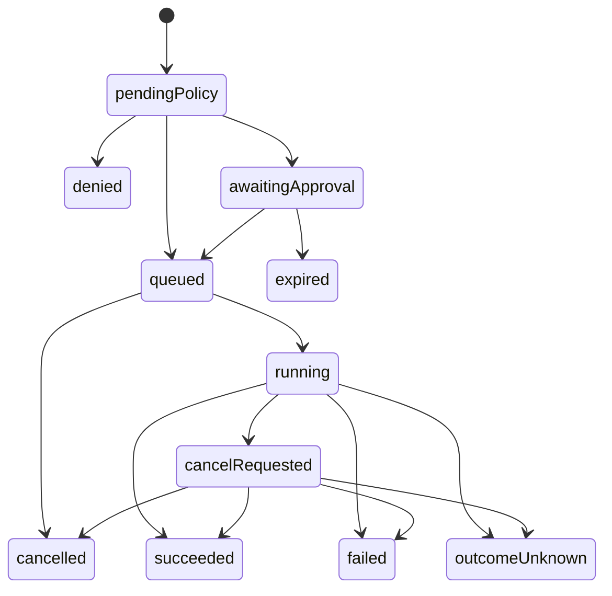

# Mac Companion Capability Protocol

## Purpose

The Mac Companion Capability Protocol is a small, provider-neutral protocol for observing and operating a Mac from an explicitly paired Apple device over a private network.

It describes capabilities, permissions, presence, approvals, tasks, results, audit events, and the authorization lifecycle for Interactive Control. It does not expose a remote shell, mirror arbitrary local APIs, carry screen frames or input events, or make provider-specific objects part of the core wire contract. Interactive media and input use the separately bounded Mac Companion Interactive Control Protocol after this protocol authorizes a session.

## Design goals

- Mutual authentication with a pinned host identity
- Explicit device grants and default-deny capability exposure
- Machine-readable schemas that a client can render safely
- Host-authoritative policy and final execution validation
- Bounded messages, collections, strings, tasks, and event retention
- Durable operation identity without promising unknowable execution outcomes
- Ordered, resumable observation streams
- Stable error codes with client-localized presentation
- Forward-compatible optional fields and explicit major-version negotiation

## Non-goals

- General-purpose terminal or filesystem transport
- Screen frames, pointer events, or keyboard events inside capability messages
- Internet relay or public discovery
- Automatic exposure of every provider action
- Background iOS socket availability or push delivery
- A universal automation language
- Wire compatibility with MCP, Home Assistant, or W3C WoT

Those systems may receive adapters later. The Mac Companion core remains narrower.

## Wire profile

Stage 0 must select and document one exact framing and serialization profile. The decision must cover:

- TLS 1.3 connection setup and certificate pinning
- Request/response multiplexing and ordered subscriptions
- Maximum frame and decompressed-message sizes
- Maximum nesting, string, array, map, and schema sizes
- Read, write, idle, approval, and task timeouts
- Keepalive and reconnect behavior
- Compression policy, initially disabled unless measurements justify it
- Rejection of duplicate, unknown-critical, or malformed fields

Signed or hashed JSON structures use the JSON Canonicalization Scheme defined by RFC 8785. An implementation may choose a deterministic binary encoding instead, but it must publish golden fixtures and cross-language tests before client and server development diverge.

All limits are part of the conformance profile, not informal implementation details.

## Secure session

The client pins a Mac Companion host identity established during pairing. That identity is independent of Bonjour names, IP addresses, Tailscale names, and network interfaces.

The client proves possession of its registered session key during connection setup. Successful transport encryption alone does not authorize requests. The host then attaches the connection to a paired-device record and its current grant revision.

Session authorization should use short-lived proof-of-possession material rather than a reusable bearer token where the selected platform APIs permit it. Reauthentication is required after revocation, key rotation, permission revision, protocol downgrade, or a bounded session lifetime.

## Common envelope

Every application message contains:

```json
{
  "protocolMajor": 1,
  "protocolMinor": 0,
  "messageID": "0193...",
  "correlationID": "0193...",
  "sentAt": "2026-08-17T18:00:00Z",
  "type": "capabilities.list",
  "body": {}
}
```

- `messageID` is unique within the sender's retained replay window.
- `correlationID` connects a reply, task, error, and audit trail to the initiating request.
- `sentAt` supports diagnostics and bounded freshness checks; it is not the sole replay defense.
- Major versions must match. Minor versions negotiate feature flags and ignore only fields declared optional.

## Core operations

The first protocol surface is deliberately small:

| Operation | Purpose |
| --- | --- |
| `session.describe` | Return host identity, negotiated features, grant and policy revisions |
| `status.snapshot` | Return bounded current status and freshness metadata |
| `events.subscribe` | Start or resume an ordered event stream |
| `capabilities.list` | Return the visible capability registry for this device |
| `capabilities.describe` | Return one capability and its bounded schemas |
| `operations.request` | Validate, approve if needed, and admit an operation |
| `operations.get` | Return durable operation state and structured result |
| `operations.cancel` | Request best-effort cancellation |
| `presence.lease` | Renew the client's declared activity lease |
| `audit.list` | Return a bounded, permission-filtered activity page |
| `interactive.request` | Request a device-granted, user-presence-backed Interactive Control session |
| `interactive.get` | Return the authoritative Interactive Control session state |
| `interactive.end` | End the caller's Interactive Control session and invalidate its channel credentials |

Pairing and recovery use a separate pre-session flow with stricter rate limits.

## Snapshots and subscriptions

A snapshot contains:

- `resourceID`
- `generation`
- `revision`
- `observedAt`
- `freshUntil`
- `value`

An event contains the same resource identity plus a monotonically increasing sequence within the current generation. Resume requests provide the last accepted sequence and generation.

Delivery is at least once within the retained resume window. Clients deduplicate by generation and sequence. If the server no longer retains the requested cursor, or the client observes a gap, it sends `resnapshotRequired`; the client fetches a new snapshot before presenting the resource as current.

Reconnection never turns last-known data into live data. The UI retains the prior value only with its observation time and an unreachable or stale label.

## Capability description

Each capability has a stable, namespaced identifier and a provider-controlled implementation generation:

```json
{
  "capabilityID": "maccompanion.system.setAudioMuted",
  "schemaVersion": 1,
  "providerID": "maccompanion.native",
  "providerGeneration": "0193...",
  "title": { "en": "Set audio mute" },
  "summary": { "en": "Set the default output mute state." },
  "parameterSchema": {
    "type": "object",
    "additionalProperties": false,
    "required": ["muted"],
    "properties": { "muted": { "type": "boolean" } }
  },
  "resultSchema": {
    "type": "object",
    "additionalProperties": false,
    "required": ["muted"],
    "properties": { "muted": { "type": "boolean" } }
  },
  "effects": {
    "dataAccess": "none",
    "changesLocalState": "reversible",
    "mayDisruptUser": false,
    "invokesExternalService": false,
    "usesCredentials": false,
    "destructive": false,
    "requiresForegroundSession": false,
    "allowedWhileLocked": true,
    "cancellation": "notApplicable"
  },
  "availabilityRevision": "0193..."
}
```

Titles and summaries are presentation metadata, never policy inputs. The client requests a locale and falls back to English or a safe identifier.

## Schema profile

Version 1 accepts only a restricted schema subset:

- Closed objects with a bounded property count
- Booleans
- Integers and finite numbers with explicit minima and maxima
- Strings with explicit maximum length and optional enumerated values
- Bounded arrays of supported primitive or closed-object items
- Explicit required fields

It excludes executable expressions, references to remote schemas, arbitrary regex validation, unbounded recursion, arbitrary binary payloads, and provider-supplied UI code. Unknown schema features make the capability unavailable on that client; they do not relax validation.

The host validates parameters at the protocol boundary, the policy boundary, and immediately before provider execution.

## Effects and policy

Capabilities declare effect facts rather than a single `safe`, `medium`, or `dangerous` label. Policy evaluates the facts alongside device grants, session state, current host conditions, requested parameters, provider generation, and local overrides.

The initial facts cover:

- Public, private, credential, or no data access
- Reversible, irreversible, or no local-state change
- Potential user disruption
- External service invocation
- Credential use
- Destructive effect
- Foreground-session requirement
- Locked-session eligibility
- Cancellation behavior

Effect declarations are bounded by provider type and can be raised by the host. A provider cannot lower host-established effects or approval requirements.

`Monitor Only`, `Standard Control`, and `Custom` are inspectable host policy profiles, not wire-level trust labels. New capabilities and new effect dimensions are denied until the Mac owner makes an explicit choice or a signed product migration supplies a conservative default.

## Approval challenge

When policy requires user presence, the Mac returns a short-lived approval challenge. The client asks the user for Face ID, Touch ID, or device-passcode-backed authorization and signs the canonical challenge with its separate approval key.

The challenge binds:

- Host and client identities
- Operation ID
- Capability ID and schema version
- Provider ID and generation
- Capability availability revision
- Canonical parameters or their digest
- Effective effect facts
- Session and grant revisions
- Policy revision
- Creation, expiry, and one-time challenge identifiers

Changing any bound field invalidates the approval. Challenges are single-use, narrowly timed, and rejected after revocation or relevant state revision.

The session key cannot satisfy a user-presence approval. An unlocked phone and an approved operation are intentionally different security states.

## Durable operations and idempotency

The client supplies a globally unique `operationID`. Before provider admission, the host stores a durable record containing the canonical request digest and policy context.

- Repeating an ID with the same digest returns the existing operation.
- Repeating an ID with a different digest is rejected.
- A stored admitted operation is not admitted a second time merely because the response was lost.
- IDs and terminal records are retained for a documented bounded window and quota.

This provides bounded idempotency, not universal exactly-once execution. If the service crashes after an irreversible or unqueryable provider side effect but before recording the result, the terminal state is `outcomeUnknown`. Mac Companion does not silently retry that action.

Desired-state capabilities are preferred because reconciliation is safer: “set muted to true” can be checked, while “toggle mute” cannot.

## Operation state machine



Cancellation is a request, not a guarantee. The response states whether the provider accepted the request, and the task remains observable until terminal. A disconnected client does not imply cancellation.

## Presence

Each live connection may renew a bounded lease declaring one advisory client activity:

- `connected`
- `viewing`
- `controlling`
- `capturing`
- `agentActive`

The host records client identity, scope, issue time, expiry, and the related operation or resource where applicable. It derives the trustworthy local indicator from actual status/subscription traffic, admitted operations, ScreenCaptureKit activity, and input admission. A client lease can refine which surface the client claims to display but cannot suppress host-derived data-access or control state.

Opening the device library does not mark every listed Mac as viewed. Expired leases clear automatically. `Disconnect` closes current transports, `Suspend device` advances the authorization epoch and blocks reconnection until locally resumed, and `Revoke` removes the pairing. None undoes completed work or promises cancellation of a non-cancellable running task.

## Reachability and host state

Live host state values are limited to observations the service can support:

- `userSessionActive`
- `userSessionLocked`
- `otherConsoleUserActive`
- `serviceStoppingForLogout`
- `hostPreparingForSleep`

`unreachable` is a client reachability state, not a host report. After connection loss the client displays `unreachable`, the last reported host state, and its timestamp. It never claims the Mac is currently sleeping simply because the socket disappeared.

## Errors

Errors carry a stable code, safe structured arguments, retry guidance, and correlation ID:

```json
{
  "code": "policy.approval_required",
  "arguments": { "capabilityID": "maccompanion.system.setAudioMuted" },
  "retry": "afterApproval",
  "correlationID": "0193..."
}
```

Clients localize known codes. Unknown codes render a generic safe message plus the correlation ID. Raw provider errors, stack traces, filesystem paths, commands, secrets, and arbitrary server strings are not sent to remote clients.

Representative namespaces are `auth.*`, `pairing.*`, `protocol.*`, `schema.*`, `policy.*`, `provider.*`, `operation.*`, `interactive.*`, `storage.*`, and `rateLimit.*`.

## Audit events

Audit events use stable event codes and include:

- Event ID and monotonic ordering value
- Host observation time
- Actor device or local component
- Correlation and operation IDs
- Capability and provider identifiers when applicable
- Policy and grant revisions
- Redacted structured fields
- Outcome code

The API is paginated and bounded. Retention gaps are explicit. Clients must not infer “nothing happened” from data that aged out or could not be written.

## Versioning and compatibility

- Protocol major versions are explicitly negotiated and incompatible by default.
- Minor versions add optional operations, fields, effect dimensions, or error codes.
- Capability schema versions are independent from protocol versions.
- Provider generation changes invalidate stale approvals and availability assumptions.
- Unknown effects, permission dimensions, or required fields fail closed.
- Golden canonicalization, envelope, schema, approval, and error fixtures are shared across Swift implementations.

## Standards relationship

W3C Web of Things Thing Description is useful conceptual prior art for machine-readable affordances, security metadata, and data schemas. Mac Companion does not claim wire compatibility with it.

RFC 8785 is the normative reference if JSON is used for approval signatures or durable request digests.

MCP, Shortcuts, Home Assistant, and command-line providers belong behind explicit adapters. Their trust and schema models do not cross the Mac Companion boundary unchanged.

## Threat model required before alpha

The executable protocol specification must test at least:

- A hostile device on the local network or tailnet
- A stolen or malicious paired client
- A malicious or compromised capability provider
- An untrusted local process attempting IPC or endpoint impersonation
- Replay, reordering, duplication, downgrade, and stale-approval attacks
- Schema bombs, oversized messages, connection floods, and task floods
- Clock rollback and disagreement between wall and monotonic time
- Audit-store exhaustion and disk-full behavior
- Bonjour, DNS, endpoint, and certificate-name spoofing
- Provider disappearance or generation change mid-operation
- Permission, policy, or effect downgrade attempts
- Forged, reordered, duplicated, oversized, or stale Interactive Control frames and input
- Input after revocation, menu-app loss, lock transition, display change, or authorization-epoch change
- Capture of the pre-lock desktop after macOS reports a locked or ambiguous user session
- Compromised host and client keys, including documented recovery limits
- Prompt injection and confused-deputy risks before any AI planner is added

Each case needs an explicit trust boundary, prevention or containment mechanism, audit behavior, and recovery story.
