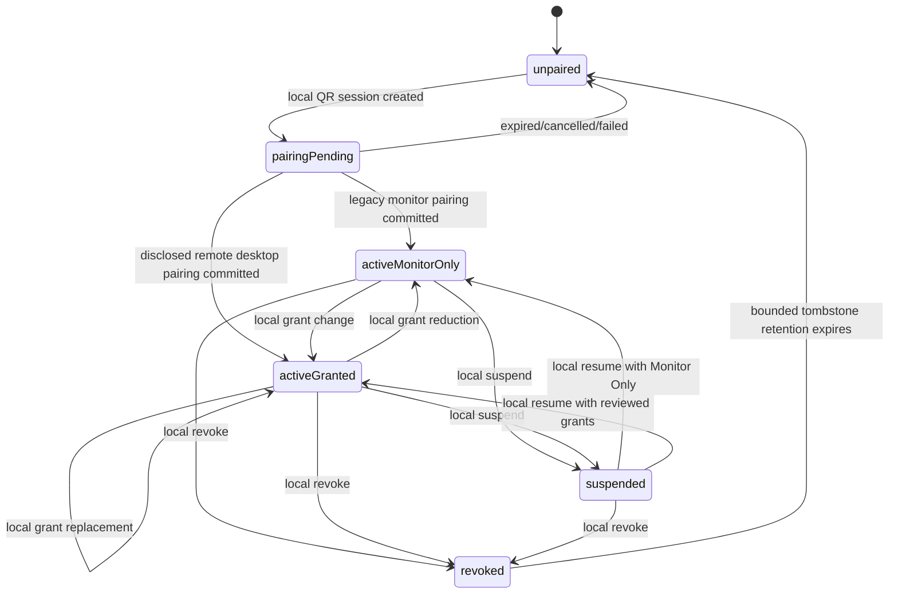
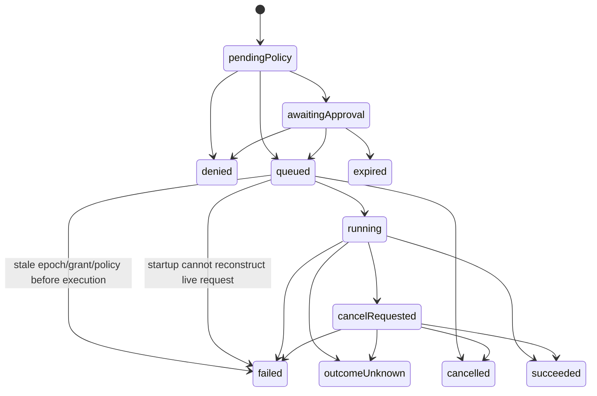

# Mac Companion Capability Protocol

## Purpose

The Mac Companion Capability Protocol is a small, provider-neutral protocol supporting Mac Companion's **Observe** and **Act** paths and the shared authorization lifecycle for **Control** from an explicitly paired Apple device over a private network.

It describes status, capabilities, permissions, presence, approvals, tasks, results, audit events, and the authorization lifecycle for Interactive Control. Observe and Act do not require a video session. It does not expose a remote shell, mirror arbitrary local APIs, carry screen frames or input events, or make provider-specific objects part of the core wire contract. Control media and input use the separately bounded Mac Companion Interactive Control Protocol after this protocol authorizes a session.

## Design goals

- Mutual authentication with a pinned host identity
- Explicit device grants and default-deny capability exposure
- Machine-readable schemas that a client can render safely
- Host-authoritative policy and final execution validation
- Bounded messages, collections, strings, tasks, and event retention
- Durable operation identity without promising unknowable execution outcomes
- Ordered, resumable observation streams
- Stable error codes with client-localized presentation
- Forward-compatible optional fields and explicit major-version negotiation
- Session-bound surface, focus, coordinate, and fallback revisions that prevent misdirected adaptive input

## Non-goals

- General-purpose terminal or filesystem transport
- Screen frames, pointer events, or keyboard events inside capability messages
- Internet relay or public discovery
- Automatic exposure of every provider action
- Background iOS socket availability or push delivery
- A universal automation language
- Wire compatibility with MCP, Home Assistant, or W3C WoT

Those systems may receive adapters later. The Mac Companion core remains narrower.

## Wire profile

The normative Stage 0 framing and serialization profile is `spec/capability-protocol/v0/README.md`, with closed message schemas and cryptographic byte encodings in its linked files. That profile covers:

- TLS 1.3 connection setup and certificate pinning
- Request/response multiplexing and ordered subscriptions
- Maximum frame and decompressed-message sizes
- Maximum nesting, string, array, map, and schema sizes
- Read, write, idle, approval, and task timeouts
- Keepalive and reconnect behavior
- Compression policy, initially disabled unless measurements justify it
- Rejection of duplicate, unknown-critical, or malformed fields

Signed or hashed JSON structures use the JSON Canonicalization Scheme defined by RFC 8785 over its documented safe-integer subset. Authentication and pairing use the normative length-prefixed binary constructions instead of JSON canonicalization. Any replacement encoding requires a new negotiated protocol version, golden fixtures, and cross-language tests before client and server development diverge.

All limits are part of the conformance profile, not informal implementation details.

## Secure session

The client pins a Mac Companion host identity established during pairing. That identity is independent of Bonjour names, IP addresses, Tailscale names, and network interfaces.

The client proves possession of its registered session key during connection setup. Successful transport encryption alone does not authorize requests. The host then attaches the connection to a paired-device record and its current grant revision.

Session authorization uses the short-lived proof-of-possession exchange in the normative v0 cryptographic profile and never a reusable bearer token. Reauthentication is required after revocation, key rotation, permission revision, protocol change, or a bounded session lifetime.

## Common envelope

The normative v0.1 envelope is closed and contains:

```json
{
  "version": { "major": 0, "minor": 1 },
  "messageID": "018f0000-0000-7000-8000-000000000003",
  "correlationID": null,
  "channel": "command",
  "kind": "status.snapshot.request",
  "sentAtUnixMilliseconds": 1787198400000,
  "body": {}
}
```

- `messageID` is unique within the connection-scoped replay window; durable state changes also require their own operation or challenge identity.
- `correlationID` connects a reply, task, error, and audit trail to the initiating request.
- `sentAtUnixMilliseconds` supports diagnostics and bounded freshness checks; it is not the sole replay defense.
- Major versions must match. Minor versions negotiate only explicitly registered features and fields.

## Core operations

The first protocol surface is deliberately small:

| Operation | Purpose |
| --- | --- |
| `session.describe` | Return host identity, negotiated features, grant and policy revisions |
| `status.snapshot` | Return bounded current status and freshness metadata |
| `events.subscribe` | Start or resume an ordered event stream |
| `capabilities.list` | Return the visible capability registry for this device |
| `capabilities.describe` | Return one capability and its bounded schemas |
| `operations.request` | Validate, approve if needed, and admit an operation |
| `operations.get` | Return durable operation state and structured result |
| `operations.cancel` | Request best-effort cancellation |
| `presence.lease` | Renew the client's declared activity lease |
| `audit.list` | Return a bounded, permission-filtered activity page |
| `interactive.session.request` | Request a device-granted, user-presence-backed Interactive Control session |
| `interactive.session.end` | End the caller's exact Interactive Control session and invalidate its channel credentials |
| `interactive.surface.list` | Return transient privacy-filtered app/window candidates inside the active session |
| `interactive.surface.select` | Select Desktop, App Focus, Window Focus, or focused-region presentation using current revisions |
| `interactive.surface.get` | Return the authoritative surface, focus, transition, and fallback state |
| `interactive.surface.ack` | Acknowledge the new descriptor and keyframe before coordinate input resumes |

Pairing and recovery use a separate pre-session flow with stricter rate limits.

## Adaptive Remote Surface control

Remote Surfaces improve presentation inside an already authorized Interactive Control session. They do not create durable application permissions, carry video in capability messages, or authorize anything outside that session.

Every surface message binds:

- Interactive Control session and authorization epoch
- Random session-scoped surface and application/window tokens
- Surface and coordinate-space revisions
- Current focus revision when focus-derived behavior is requested
- Privacy profile and permitted interaction class
- Bounded expiry and per-direction sequence

The surface kinds are `desktop`, `application`, `window`, and `focusedRegion`.
The first Desktop uses a distinct request/descriptor/ack/acknowledged exchange:
configuration and a clean keyframe precede the acknowledgement, and both
endpoints keep input denied until its exact reply. Later selection uses the
replacement exchange and the same per-direction sequences. Experimental
`textInput` is available only after the host verifies a current ordinary
editable focus. Later `semantic` and `provider` kinds require separate schema
and effect review.

`interactive.surface.list` is available only during an active unlocked Interactive Control session. It returns localized app names and icons, opaque tokens, generic window ordinals, and availability. It omits titles, document paths, URLs, thumbnails, Accessibility labels, and content by default.

A successful selection advances surface and coordinate revisions. The closed primary-channel exchange is `interactive.surface.select` → `interactive.surface.selected` → `interactive.surface.ack` → `interactive.surface.acknowledged`. The selected response carries a relative-validity descriptor and exact prior-media boundary; the acknowledgement carries the full surface/focus fence and admitted clean-frame sequence. Coordinate input remains paused until the Agent/runtime proof is returned. If the source disappears, focus becomes ambiguous, or a modal surface cannot be included, the host emits `interactive.surface.fallback` and returns to a safe application or desktop surface.

Experimental text messages use `interactive.text.begin`, `interactive.text.input`, and `interactive.text.end`. They also bind an opaque focus and element token. The first profile is keystroke-only and carries no field value. Focus loss, app or surface change, lock, timeout, or revision mismatch ends the text session before accepting another event.

Secure or ambiguous fields never expose value, selection, length, label, placeholder, or description. The complete normative model is defined in `adaptive-remote-surfaces.md`.

## Snapshots and subscriptions

A snapshot contains:

- `resourceID`
- `generation`
- `revision`
- `observedAt`
- `freshUntil`
- `value`

An event contains the same resource identity plus a monotonically increasing sequence within the current generation. Resume requests provide the last accepted sequence and generation.

Delivery is at least once within the retained resume window. Clients deduplicate by generation and sequence. If the server no longer retains the requested cursor, or the client observes a gap, it sends `resnapshotRequired`; the client fetches a new snapshot before presenting the resource as current.

Reconnection never turns last-known data into live data. The UI retains the prior value only with its observation time and an unreachable or stale label.

The v0.1 client races the ordered route candidates with a 250-millisecond stagger and accepts only the first route that completes the pinned host check and application authentication. Exhausted rounds use bounded jittered backoff; foreground entry, restored reachability, and route replacement reset that backoff. Backgrounding closes the foreground connection. Explicit Disconnect and authorization denial require explicit resumption and are never treated as transient route failures.

Snapshot validity is anchored to the client monotonic clock when received after conservatively subtracting the host-reported snapshot age and the full measured request round trip. A connected but expired observation is `stale`; a disconnected retained observation is `unreachable`; neither is `live`.

## Capability description

Each capability has a stable, namespaced identifier and a provider-controlled implementation generation:

```json
{
  "capabilityID": "maccompanion.system.setAudioMuted",
  "schemaVersion": 1,
  "providerID": "maccompanion.native",
  "providerGeneration": "0193...",
  "title": { "en": "Set audio mute" },
  "summary": { "en": "Set the default output mute state." },
  "parameterSchema": {
    "type": "object",
    "additionalProperties": false,
    "required": ["muted"],
    "properties": { "muted": { "type": "boolean" } }
  },
  "resultSchema": {
    "type": "object",
    "additionalProperties": false,
    "required": ["muted"],
    "properties": { "muted": { "type": "boolean" } }
  },
  "effects": {
    "dataAccess": "none",
    "changesLocalState": "reversible",
    "mayDisruptUser": false,
    "invokesExternalService": false,
    "usesCredentials": false,
    "destructive": false,
    "requiresForegroundSession": false,
    "allowedWhileLocked": true,
    "cancellation": "notApplicable"
  },
  "availabilityRevision": "0193..."
}
```

Titles and summaries are presentation metadata, never policy inputs. The client requests a locale and falls back to English or a safe identifier.

## Schema profile

Version 1 accepts only a restricted schema subset:

- Closed objects with a bounded property count
- Booleans
- Safe integers with explicit minima and maxima; floating-point schemas require a later protocol profile and complete ECMAScript number-serialization conformance
- Strings with explicit maximum length and optional enumerated values
- Bounded arrays of supported primitive or closed-object items
- Explicit required fields

It excludes executable expressions, references to remote schemas, arbitrary regex validation, unbounded recursion, arbitrary binary payloads, and provider-supplied UI code. Unknown schema features make the capability unavailable on that client; they do not relax validation.

The host validates parameters at the protocol boundary, the policy boundary, and immediately before provider execution.

## Effects and policy

Capabilities declare effect facts rather than a single `safe`, `medium`, or `dangerous` label. Policy evaluates the facts alongside device grants, session state, current host conditions, requested parameters, provider generation, and local overrides.

The initial facts cover:

- Public, private, credential, or no data access
- Reversible, irreversible, or no local-state change
- Potential user disruption
- External service invocation
- Credential use
- Destructive effect
- Foreground-session requirement
- Locked-session eligibility
- Cancellation behavior

Effect declarations are bounded by provider type and can be raised by the host. A provider cannot lower host-established effects or approval requirements.

`Monitor Only`, `Standard Control`, and `Custom` are inspectable host policy profiles, not wire-level trust labels. New capabilities and new effect dimensions are denied until the Mac owner makes an explicit choice or a signed product migration supplies a conservative default.

## Approval challenge

Normal remote-desktop session starts use a short-lived, fully bound challenge signed by the paired protected session key, without per-session biometric confirmation. The fixed Remote Control grant, one-use challenge, current revisions, host pin and visible admission remain required. Deferred action paths retain their policy-driven approvals. When policy requires user presence, the Mac returns a short-lived approval challenge. The client asks the user for Face ID, Touch ID, or device-passcode-backed authorization and signs the canonical challenge with its separate approval key.

The challenge binds:

- Host and client identities
- Operation ID
- Capability ID and schema version
- Provider ID, version, generation, and execution revision
- Canonical parameters or their digest
- Effective effect facts
- Relevant host-session state
- Device grant revision and authorization epoch
- Policy revision
- Negotiated protocol version and authenticated-session identity
- Creation, expiry, and one-time challenge identifiers

Changing any bound field invalidates the approval. Challenges are single-use, narrowly timed, and rejected after revocation or relevant state revision.

The session key cannot satisfy a user-presence approval. An unlocked phone and an approved operation are intentionally different security states.

## Device authorization lifecycle



The remote-desktop MVP pairing commits `activeGranted` with exactly `maccompanion.interactive.control` after explicit local pairing consent. The legacy Monitor Only profile commits `activeMonitorOnly` without grants. Both initial commits use epoch and grant revision 1. Every later durable grant change, suspend, resume, or revoke advances the authorization epoch. `revoked` is terminal for the device identity: re-pairing creates a new device identity rather than transitioning the old record back to active. The final tombstone transition removes only the retained anti-replay/audit marker after its documented window; it does not restore trust.

## Durable operations and idempotency

The client supplies a globally unique `operationID`. Before provider admission, the host stores a durable record containing the canonical request digest and policy context.

- Repeating an ID with the same digest returns the existing operation.
- Repeating an ID with a different digest is rejected.
- A stored admitted operation is not admitted a second time merely because the response was lost.
- IDs and terminal records are retained for a documented bounded window and quota.

This provides bounded idempotency, not universal exactly-once execution. If the service crashes after an irreversible or unqueryable provider side effect but before recording the result, the terminal state is `outcomeUnknown`. Mac Companion does not silently retry that action.

Desired-state capabilities are preferred because reconciliation is safer: “set muted to true” can be checked, while “toggle mute” cannot.

## Operation state machine



Cancellation is a request, not a guarantee. The response states whether the provider accepted the request, and the task remains observable until terminal. A disconnected client does not imply cancellation.

## Presence

Each live connection may renew a bounded lease declaring one advisory client activity:

- `connected`
- `viewing`
- `controlling`
- `capturing`
- `agentActive`

The host records client identity, scope, issue time, expiry, and the related operation or resource where applicable. It derives the trustworthy local indicator from actual status/subscription traffic, admitted operations, ScreenCaptureKit activity, and input admission. A client lease can refine which surface the client claims to display but cannot suppress host-derived data-access or control state.

Opening the device library does not mark every listed Mac as viewed. Expired leases clear automatically. `Disconnect` closes only the selected live connection or Interactive Control session and leaves the durable grant unchanged. `Suspend device` is device-wide: it advances the authorization epoch, closes all capability transports and Observe subscriptions, ends Interactive Control, invalidates approvals and channel credentials, prevents queued Act work from claiming execution, and blocks reconnection until local resume advances the epoch again. `Revoke` permanently removes the pairing and grants after durable fencing. None undoes completed work or promises cancellation of a non-cancellable running task.

## Reachability and host state

Live host state values are limited to observations the service can support:

- `userSessionActive`
- `userSessionLocked`
- `otherConsoleUserActive`
- `serviceStoppingForLogout`
- `hostPreparingForSleep`

`unreachable` is a client reachability state, not a host report. After connection loss the client displays `unreachable`, the last reported host state, and its timestamp. It never claims the Mac is currently sleeping simply because the socket disappeared.

## Errors

Errors carry a stable code, safe structured arguments, retry guidance, and correlation ID:

```json
{
  "code": "policy.approval_required",
  "arguments": { "capabilityID": "maccompanion.system.setAudioMuted" },
  "retry": "afterApproval",
  "correlationID": "0193..."
}
```

Clients localize known codes. Unknown codes render a generic safe message plus the correlation ID. Raw provider errors, stack traces, filesystem paths, commands, secrets, and arbitrary server strings are not sent to remote clients.

Representative namespaces are `auth.*`, `pairing.*`, `protocol.*`, `schema.*`, `policy.*`, `provider.*`, `operation.*`, `interactive.*`, `interactive.surface.*`, `interactive.text.*`, `storage.*`, and `rateLimit.*`.

## Audit events

Audit events use stable event codes and include:

- Event ID and monotonic ordering value
- Host observation time
- Actor device or local component
- Correlation and operation IDs
- Capability and provider identifiers when applicable
- Policy and grant revisions
- Redacted structured fields
- Outcome code

The API is paginated and bounded. `audit.list` requires `audit.readSelf` in the MVP and exposes only the requesting device's pairing/session lifecycle, requests and outcomes, and coarse host security-state transitions needed to explain availability. It excludes other device identities and activity, network metadata, and provider-private fields. Broader remote audit access requires a separate local grant and privacy review. Retention gaps are explicit. Clients must not infer “nothing happened” from data that aged out or could not be written.

## Versioning and compatibility

- Protocol major versions are explicitly negotiated and incompatible by default.
- Minor versions add optional operations, fields, effect dimensions, or error codes.
- Capability schema versions are independent from protocol versions.
- Provider generation changes invalidate stale approvals and availability assumptions.
- Unknown effects, permission dimensions, or required fields fail closed.
- Golden canonicalization, envelope, schema, approval, and error fixtures are shared across Swift implementations.

## Standards relationship

W3C Web of Things Thing Description is useful conceptual prior art for machine-readable affordances, security metadata, and data schemas. Mac Companion does not claim wire compatibility with it.

RFC 8785 is the normative reference if JSON is used for approval signatures or durable request digests.

MCP, Shortcuts, Home Assistant, and command-line providers belong behind explicit adapters. Their trust and schema models do not cross the Mac Companion boundary unchanged.

## Threat model required before alpha

The executable protocol specification must test at least:

- A hostile device on the local network or tailnet
- A stolen or malicious paired client
- A malicious or compromised capability provider
- An untrusted local process attempting IPC or endpoint impersonation
- Replay, reordering, duplication, downgrade, and stale-approval attacks
- Schema bombs, oversized messages, connection floods, and task floods
- Clock rollback and disagreement between wall and monotonic time
- Audit-store exhaustion and disk-full behavior
- Bonjour, DNS, endpoint, and certificate-name spoofing
- Provider disappearance or generation change mid-operation
- Permission, policy, or effect downgrade attempts
- Forged, reordered, duplicated, oversized, or stale Interactive Control frames and input
- Input after revocation, menu-app loss, lock transition, display change, or authorization-epoch change
- Capture of the pre-lock desktop after macOS reports a locked or ambiguous user session
- Surface-token substitution, stale coordinate or focus revisions, invisible modal windows, and app/window identity reuse
- Accessibility timeouts or malformed metadata promoted into trusted semantic actions
- Secure-field values, selections, labels, or typed content leaked through surface metadata, audit, or diagnostics
- Compromised host and client keys, including documented recovery limits
- Prompt injection and confused-deputy risks before any AI planner is added

Each case needs an explicit trust boundary, prevention or containment mechanism, audit behavior, and recovery story.
