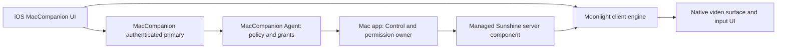

# MacCompanion: Sunshine server and Moonlight iOS integration plan

Date: 2026-09-26
Status: implementation started; upstream baseline and integration admission in progress

Current evidence: [2026-09-26 foundation](evidence/2026-09-26-sunshine-moonlight-foundation.md)
and [native owner/enrollment checkpoint](evidence/2026-09-26-native-video-owner-and-enrollment.md),
followed by [managed host enrollment](evidence/2026-09-26-managed-native-host-enrollment.md)
and [authenticated primary enrollment](evidence/2026-09-26-native-video-primary-enrollment.md),
then [native client TLS/launch](evidence/2026-09-26-native-client-tls-launch.md),
[sealed managed host](evidence/2026-09-27-sealed-managed-native-host.md), and
[authenticated Mac runtime snapshot](evidence/2026-09-27-authenticated-native-runtime-snapshot.md).
Next composition: [integration contract candidate](sunshine-moonlight-integration-contract.md).
GPL adoption, exact reference sources, first Simulator video frame, extracted
native framework builds, and component lifecycle checks are implemented.
Explicitly admitted Debug builds now select native adapters in both normal roots.
The [normal iOS Simulator checkpoint](evidence/2026-09-27-normal-native-control-simulator.md)
proves pairing, saved-route reopening and two native video/input/Stop sessions
against a disposable signed Mac test host. Installed normal Mac GUI/TCC, paired
LAN/physical acceptance, permanent Release selection and Phase 0 performance
measurements remain open. This development acceptance does not close the Phase 1
dependency/packaging gates.

## 1. Decision and intended experience

Develop the Mac server and iOS client together around Sunshine and Moonlight.
The user has accepted GPL licensing for the combined product. The target is
one MacCompanion experience: install the Mac app and iOS app, pair through
MacCompanion, request Control, and operate the Mac with useful touch and
keyboard controls. Separate Sunshine setup or a separate Moonlight app is
not the intended finished experience.

Use a managed Sunshine-derived server component inside the Mac application
distribution and a Moonlight-derived streaming engine inside the iOS app.
Keep the upstream projects recognizable and maintain a small, documented
patch set. Directly merging all Sunshine code into the Swift Agent is not
the starting architecture; an internal process boundary helps lifecycle,
fault isolation, and upstream updates. It is not a licensing exemption.

The existing Observe, Act, and Control product paths remain independently
authorized. The streaming engine serves Control; pairing and stream
connectivity alone never grant capture or input. Observe and Act should
continue working without an active video session.

## 2. Current starting point

- The user reports that Sunshine with Moonlight works better on their devices.
  Record its exact versions and settings in the baseline phase; this is not
  yet a measured comparison with the new integrated product.
- This checkout contains unfinished normal-app WebRTC development changes.
  The existing evidence documents describe a preview, not a completed video
  engine replacement. Preserve that work in a recoverable checkpoint before
  beginning the new engine integration. Do not reset the dirty worktree.
- At plan approval, the repository had an Apache-2.0 license and a closed
  dependency policy. GPL adoption now retains the original Apache text and
  permissions under `../LICENSING.md`. Sunshine/Moonlight dependency admission
  still requires exact source, policy, notice, build, SBOM, and packaging review.
- Existing permanent-target, signing, TCC, and release gates remain governed
  by `docs/execution-status.md`. Do not assume historical toolchain or
  installed-device facts are still current.

This plan changes development direction. It does not silently change the
normative capability protocol or certify upstream authentication as equivalent
to MacCompanion's application authentication.

## 3. Target architecture

### Mac server

- Keep native onboarding, status, Control approval, activity indication, Stop,
  and permission guidance in the Mac app.
- Adapt a pinned Sunshine source revision for capture, encoding, streaming,
  and the host parts of the selected input path.
- Resolve capture/input process ownership before permanent integration.
  Sunshine supports ScreenCaptureKit and VideoToolbox on macOS, but our
  fork must fit the existing TCC attribution and approved lifecycle. A managed
  helper must not introduce an unreviewed capture/input owner.
- Give the component a narrow authenticated local interface: prepare, start,
  stop, surface selection, health, and bounded stream configuration. Bind
  commands and callbacks to the current host/client/session generation and
  authorization epoch. Do not expose arbitrary command execution or the
  upstream game-launch configuration as remote capabilities.
- Stop capture and input when Control expires, is revoked, loses its visible
  owner, or cannot prove the current session. A helper crash must release
  held inputs and leave Observe/Act recoverable.
- Manage only the component belonging to this installation. Detect port
  conflicts with the user's existing Sunshine installation without modifying
  or stopping it automatically.

### iOS client

- Use Moonlight iOS's existing streaming/rendering implementation as the
  first working reference, then adapt it behind a bounded client interface.
  Reuse `moonlight-common-c` with its exact pinned dependencies.
- Preserve MacCompanion navigation, host selection, Observe/Act workspace,
  Control status, Stop, and reconnect explanations.
- Make session preparation, first decoded frame, active viewing, failure,
  and return to workspace explicit states. A session failure should show a
  useful reason instead of briefly opening a view and silently dismissing it.
- Reconcile Moonlight's pairing/discovery with MacCompanion onboarding.
  Existing credentials are not interchangeable by assumption. Choose either
  an authenticated enrollment bridge with matching cryptographic vectors or
  an explicit one-time re-pairing migration if safe credential reuse cannot
  be established. The finished UI should have one understandable pairing flow.

### Video and input boundary

Evaluate two concrete arrangements during the initial experiment:

1. Sunshine/Moonlight video with MacCompanion's existing authenticated input
   path, after an exact stream/surface presentation fence is defined.
2. Sunshine/Moonlight video and input, with every host input admission guarded
   by MacCompanion's current Control grant and surface state.

Choose based on latency, coordinate correctness, permission ownership, and
reviewability. Do not run both input paths for the same gesture. Input is
enabled only after the current stream's displayed frame and coordinate space
have been validated. A local decoded-frame callback alone is not a new grant.

## 4. Implementation sequence and completion checks

### Phase 0 — Freeze sources and establish the baseline

1. Preserve the existing WebRTC/focus changes as a coherent local checkpoint.
2. Record the user's working Sunshine/Moonlight versions, codec, resolution,
   frame rate, bitrate, Mac hardware, network, and iPhone settings.
3. Select exact upstream revisions and recursively pin their submodules and
   dependencies. Record licenses, provenance, build commands, and patch scope.
4. Keep disposable experiments under `Experiments/`; do not link experiments
   into permanent release targets. Use isolated upstream source checkouts
   rather than mixing an uncontrolled source import into this dirty tree.
5. Reproduce streaming from source on the Mac and iOS client. Measure startup,
   decode/render, dropped frames, input response, reconnect, and bandwidth.

Completion: both source-built sides work with a recorded configuration and
an attributable baseline. Record real-device results separately from Simulator
and package test results. Local experiments do not require publication of forks.

### Phase 1 — GPL adoption and integration contracts

1. Adopt the combined product's GPL-3.0 distribution model while preserving
   original Apache and upstream notices where applicable. Audit contributor
   rights, file notices, third-party exceptions, and transitive dependencies.
2. Prepare corresponding source and reproducible build instructions for both
   apps, including the managed host, client library, patches, and dependencies.
3. Update dependency policy and authoritative fixtures before admitting code
   or binaries to permanent targets. Update SBOM/privacy/signing inventories.
4. Write an architecture decision for process/TCC ownership, pairing migration,
   the selected input path, stream authorization, ports, and helper lifecycle.
5. Update normative specifications and fixtures before changing wire/security
   behavior. `spec/fixtures/manifest.json` remains the only capability fixture
   index. Application authentication, pairing, approvals, and operation
   signatures require matching golden cryptographic vectors.

Completion: the integration contracts and dependency policy admit an exact
candidate; the user-visible pairing and Control journey is specified. App
Store/legal distribution review is a release dependency, not a reason to stop
source-built local development.

### Phase 2 — First integrated Desktop session on both apps

1. Build and supervise the managed Mac server from the Mac app lifecycle.
2. Integrate the client engine into the normal iOS Control surface.
3. Support same-LAN connection, one Desktop surface, a reliable initial codec,
   touch pointer/click/scroll, visible session status, and Stop.
4. Implement session-specific admission and teardown on both sides. Gate all
   upstream listeners, credentials, and input routes so a paired client cannot
   bypass current MacCompanion Control approval.
5. Handle first-frame failure, connection loss, helper/app crash, permission
   loss, and stale callbacks with explicit recovery. Reconnect does not restore
   an expired grant or replay an input.
6. Disable the development WebRTC overlay for the selected engine path; keep
   one active media owner. Remove superseded code only after replacement proof.

Completion: ten consecutive approved starts reach a stable live screen; a
30-minute session remains usable; ten Stop/revocation checks stop video and
input; no stale frame or input survives a session change. Installable Mac and
iOS builds are a milestone, separate from physical acceptance.

### Phase 3 — Mac keyboard and shortcut experience

1. Add an obvious keyboard button and toolbar with Command, Option, Control,
   Shift, Esc, Tab, Delete, arrows, navigation keys, and function keys.
2. Support held, one-shot, and visibly latched modifiers plus editable shortcut
   presets. Include copy/paste keystrokes, app switching, Spotlight, and common
   Xcode/Terminal actions. Keystroke paste does not introduce clipboard sync.
3. Separate committed text entry from physical key events. Test English and
   Chinese text, punctuation, keyboard layouts, hardware keyboards, selection,
   and composition without recording typed content.
4. Release all keys and buttons on Stop, backgrounding, disconnect, permission
   loss, and expiry. Verify secure-field and macOS-reserved shortcut behavior;
   explain unsupported behavior without weakening platform restrictions.
5. Adjust the visible surface when the keyboard opens so the working area
   remains accessible.

Completion: real tasks in Terminal, Xcode, a browser, and a text editor can be
performed with text, shortcuts, and modifiers; fault tests produce no stuck
modifier or duplicate key. This is the first usability milestone.

### Phase 4 — App/window focus and recovery

1. Integrate app activation, window selection, and Desktop fallback.
2. Preserve related dialogs, sheets, popovers, and full-screen transitions.
3. Bind input coordinates and displayed frames to the selected surface revision.
   Pause input during transitions and resume only on a validated new frame.
4. Test resize, move, display change, window closure, sleep/wake, lock, client
   foreground return, and host/helper restart.
5. Add explicitly saved private routes after the LAN path passes; do not enable
   internet exposure, port forwarding, or relay use as an implicit default.

Completion: twenty consecutive reconnect/surface-transition journeys pass,
including Stop-to-Observe and retained Act availability; permission/lock/session
failures cannot target a stale or unintended surface.

### Phase 5 — Visible-area streaming and adaptive bitrate

This is a custom host/client extension, not an assumed upstream feature.
Implement one change at a time against the full-frame baseline:

1. Stream a selected window instead of the entire desktop where appropriate.
2. Send the client's visible viewport to the host with bounded dimensions,
   surface revision, coordinate transform, and update rate.
3. Capture/encode the viewport with a modest surrounding margin so panning
   does not reveal blank edges. Maintain stable encoder dimensions initially
   to avoid repeated decoder reconfiguration.
4. Adapt total bitrate to measured delivery/decode pressure and text clarity.
   Cropping and bitrate adaptation are separate controls.
5. Compare a low-detail overview plus sharp viewport only if the simpler crop
   performs insufficiently. Evaluate encoder region prioritization only after
   confirming support on the selected macOS hardware encoder.

Use zoom/window bounds as the priority signal; eye tracking is not required.
When the whole desktop is visible, a viewport crop has little area to discard.
Client-side zoom alone does not reduce transmitted data. Changed bounds must
not permit capture outside the authorized surface or misdirect input.

Completion: matched before/after trials report median and p95 interaction
latency, bitrate, frame age, dropped frames, text readability, Mac CPU/GPU,
iPhone thermal behavior, and pan recovery. Freeze numerical acceptance targets
after Phase 0 measurements, before optimization trials. Retain the extension
only if it provides measured benefit without unacceptable latency or artifacts.

### Phase 6 — Product cutover and distribution

1. Make the proven engine the normal Control path and retire redundant video
   code with regression coverage for Observe, Act, and Control.
2. Preserve existing app data and grants where compatible; document and expose
   any one-time pairing migration. Test upgrade and rollback with owned data.
3. Verify managed-server startup, quit, updates, disablement, crash recovery,
   signatures, permission attribution, and uninstall behavior.
4. Repeat required repository validation and the approved stable-toolchain
   lane. Existing fixed-tool failures remain recorded until properly resolved.
5. Produce exact-source signed artifacts and the corresponding source bundle.
   Complete GPL notices/source obligations, dependency/privacy review, Apple
   distribution review, and existing release gates before external release.

Completion: both normal apps pass the agreed physical matrix and distribution
checks from a frozen source candidate. Publication and release are later actions.

## 5. Initial scope and priority

The first usable build includes integrated Desktop streaming, normal approval
and Stop, touch input, visible keyboard controls, Mac modifiers/shortcuts, and
clear failures. Next come app/window focus and reconnect. Viewport optimization
follows the usable baseline.

Audio, clipboard synchronization, file transfer, gamepad emulation, public
internet exposure, and VR/eye tracking remain separate capabilities. Their
presence in upstream code does not enable them in MacCompanion. Startup,
input cleanup, and Control revocation are required for the first usable build.

## 6. Upstream maintenance and evidence

- Keep distinct host and client patch series with recorded upstream revisions.
  Prefer adapters and small upstreamable changes over broad rewrites.
- Maintain a compatibility matrix for host, client, and bridge versions; fail
  visibly on unsupported combinations instead of guessing wire semantics.
- Review upstream security fixes and test upgrades against keyboard, teardown,
  surface mapping, and latency regressions before replacing pinned sources.
- Retain bounded content-free diagnostics. Do not commit screenshots, typed
  content, SDP/session secrets, certificates, profiles, or real audit stores.
- Separate package/Simulator evidence, source-built upstream interoperability,
  signed-install evidence, physical behavior, and release acceptance.

## 7. Sources and linked project evidence

Upstream facts checked 2026-09-26; exact implementation revisions are selected
and recorded in Phase 0.

- [Sunshine source and macOS feature matrix](https://github.com/LizardByte/Sunshine)
  documents ScreenCaptureKit capture and VideoToolbox encoding.
- [Sunshine setup](https://docs.lizardbyte.dev/projects/sunshine/latest/md_docs_2getting__started.html)
- [Moonlight iOS source](https://github.com/moonlight-stream/moonlight-ios)
- [Moonlight client core](https://github.com/moonlight-stream/moonlight-common-c)
  and [keyboard/text API](https://github.com/moonlight-stream/moonlight-common-c/blob/master/src/Limelight.h)
- [Sunshine license](https://github.com/LizardByte/Sunshine/blob/master/LICENSE),
  [Moonlight iOS license](https://github.com/moonlight-stream/moonlight-ios/blob/master/LICENSE.txt),
  and [Moonlight core license](https://github.com/moonlight-stream/moonlight-common-c/blob/master/LICENSE.txt)
- [Current WebRTC development preview](evidence/2026-09-23-webrtc-normal-app-development-preview.md)
- [Physical Control return investigation](evidence/2026-09-23-physical-control-request-return.md)
- [Execution and release gates](execution-status.md)

## 8. Next implementation deliverable

Begin with Phase 0: a reproducible, pinned, source-built Mac server and iOS
client experiment plus the baseline measurements. Then implement both sides
of the integrated Desktop session and keyboard milestone under the reviewed
contracts. The owner authorized implementation after reviewing this plan.
Source builds and local integration proceed within the existing gates;
external publication and release remain separate actions.

Latest implementation checkpoint: [menu-owned native backend operations](evidence/2026-09-27-menu-owned-native-backend.md). The next live milestone is a complete authenticated normal-app native enrollment, launch, frame and Stop journey under the existing admission gates.

Latest live host checkpoint: [real menu admission and managed native Desktop launch](evidence/2026-09-27-real-menu-native-launch.md). It proves HTTPS launch and menu Stop under the production runtime; decoded normal-app video and authenticated XPC/primary composition remain next.

Latest authenticated checkpoint: [signed native launch and renewal continuity](evidence/2026-09-27-authenticated-native-launch-and-renewal.md). Real primary/XPC enrollment and HTTPS launch now pass, including two lease renewals and Stop preserving Observe. The next milestone is visible native playback through the normal UIKit owners on the dedicated Simulator, followed by presentation/input admission and packaging gates.

Latest client checkpoint: [native playback through normal client owners](evidence/2026-09-27-normal-client-native-simulator.md). Two visible native frame/Stop/restart cycles pass on the dedicated Simulator with a finite generated bootstrap and Observe preserved. Next are continuous legacy-stream Stop repair, native presentation/input admission and permanent process/dependency packaging. This does not enable native input or install either normal app.

Latest shutdown checkpoint: [continuous native Stop and restart](evidence/2026-09-27-continuous-native-stop.md). Immediate local input fencing, retained ending-role drainage and host runtime revocation before engine cleanup repair the measured continuous active-stream race. Two visible native cycles, same-primary Observe, the signed host renewal lane, both SDK builds and fifteen component checks pass. Next are native presentation/input admission and permanent process/dependency packaging; Stop at every handshake/transition suspension still needs separate acceptance evidence. Native input and physical installation remain open.

Latest geometry checkpoint: [normal Desktop projection in native playback](evidence/2026-09-27-native-desktop-geometry.md). Native experiments now use the normal Mac Desktop preparer, actual logical display bounds and the shared capture profile instead of a synthetic 640×480 desktop. Two visible native/Stop/restart cycles, authenticated host launch/renewal and stable validation pass. Native presentation/input admission and exact content/viewport mapping remain next; input, focused App/Window capture, normal packaging and physical installation remain open.

Latest input checkpoint: [host pause before native presentation](evidence/2026-09-27-native-host-input-pause.md). The serialized Mac runtime now refuses every input class before native preparation, releases held input before backend creation, preserves the pause through renewal and drains on release failure. Seven focused host regressions, two continuous native video/Stop/restart cycles, the signed host renewal lane, both SDK builds, fifteen component tests and stable validation pass. Next is the correlated native presentation receipt that can release this pause, followed by the existing keyboard/modifier/shortcut/pointer controls and exact content/viewport mapping. Native input and physical installation remain open.

Latest local geometry checkpoint: [native source content mapping](evidence/2026-09-27-native-content-mapping.md). Shared geometry and the existing direct-touch/trackpad mapper distinguish capture pixels, encoded pixels, Mac logical points and viewport points, excluding padding. Indexed geometry cases, stable validation and both SDK component builds pass. Next are the trusted host geometry projection and correlated native presentation receipt, then connection to normal controls. Native input remains disabled; no new live video/input acceptance is claimed at this geometry-only source snapshot.

Latest geometry projection checkpoint: [logical Desktop snapshot and Agent projection](evidence/2026-09-27-native-logical-snapshot.md). Mandatory logical dimensions and rotation now reach the internal Agent enrollment snapshot without encoded-size substitution. Renewal preserves them; changes during backend construction reject enrollment. Stable validation, both SDK builds, fifteen component tests and two refreshed continuous video/Stop/restart cycles pass. Next are trusted capture-mode/clean-aperture geometry and the correlated native presentation acknowledgement, then the normal input controls. Both native input gates and physical installation remain open.

Latest capture checkpoint: [menu-owned capture-mode geometry](evidence/2026-09-27-native-capture-mode-admission.md). The local native scope binds logical size/rotation, and the menu retains current capture-mode geometry before its inert factory, revalidating through setup and the watchdog. Changed or lost geometry revokes/drains the backend. Twelve focused Mac tests, stable validation, both SDK builds, fifteen component tests, managed/signed host lanes and the refreshed two-cycle Simulator journey pass. A prior pre-native restart failure did not repeat; its cause remains unverified and restart reliability remains open. Next are actual backend sample/image placement, correlated native presentation admission and the normal controls. Native input and physical installation remain pending.

Latest sample checkpoint: [actual native capture evidence](evidence/2026-09-27-native-backend-sample-evidence.md). The managed host binds HTTPS/RTSP video mode to its admitted geometry and reports actual pixel-buffer/format/clean-aperture metadata. Strict, fresh, operation-bound evidence reaches the Agent through the current Mac health receipt. Stable validation, both SDK builds, fifteen component tests, focused checks and signed host renewal/Stop pass. The evidence document records the source-bound Simulator runs. Next is correlated native presentation admission, then keyboard/modifiers/shortcuts/pointer/focus controls. Both native input gates, permanent packaging and physical installation remain open.

Latest presentation checkpoint: [correlated native presentation receipt](evidence/2026-09-27-native-presentation-receipt.md). The normal UIKit native owner checks actual AVFoundation display readiness and foreground visibility before the current Control-primary acknowledgement. The host joins fresh actual capture evidence and trusted geometry. A reproduced shared-health/watchdog race is repaired; cancellation, retirement and client geometry mismatch regressions pass. Stable validation with 108 fixtures, both SDK builds and two final native frame/receipt/Stop/restart Simulator cycles pass with input disabled and cleanup verified. Next is a revalidated runtime presentation permit and final input posting fence, then the existing keyboard/modifier/shortcut/pointer/focus controls. Permanent packaging and physical installation remain open.

Latest posting checkpoint: [native input posting boundary](evidence/2026-09-27-native-input-posting.md). The final Mac posting callback rechecks exact scope and both deadlines after asynchronous window activation, fences cancellation and admits one bounded batch. Five new Mac regressions, stable validation with 109 fixtures, both SDK builds, fifteen Simulator component tests and the six-framework inventory pass. Native input remains disabled until the current presentation receipt installs a runtime/backend permit. Connecting that permit and the normal controls remains next; permanent packaging and physical installation remain open.

Latest runtime input checkpoint: [serialized native runtime input permit](evidence/2026-09-27-native-runtime-input-permit.md). Exact paused Desktop installation now joins the original Control generation/deadline and surface geometry. Keyboard/text/modifier/pointer/reset input uses the native posting boundary, renewal retains the primitive, and re-pause/surface change/termination revokes shared copies. Four new runtime tests, one suspended-post revocation test, stable validation with 109 fixtures, both SDK builds, fifteen Simulator component tests and the inventory pass. Live backend/presentation installation and enabling UIKit controls remain next. Native input is still disabled in the normal composition; permanent packaging and physical installation remain open.

Latest backend input checkpoint: [managed native backend input executor](evidence/2026-09-27-native-backend-input-executor.md). The local posting seam now requires atomic process/Control permission, current physical capture geometry, exact operation and fresh actual sample with both original and short lease bounds. Geometry loss permanently revokes the permit. Two new Mac tests, stable validation with 109 fixtures, both SDK builds, fifteen Simulator component tests, the six-framework inventory and isolated Sunshine host launch/Stop pass. Connecting the correlated receipt to this executor and the runtime permit remains next, followed by visible UIKit controls. Native input and physical installation remain open.

Latest live input-admission checkpoint: [native presentation-to-input handoff](evidence/2026-09-27-native-presentation-input-handoff.md). The authenticated Agent/menu path now installs the exact backend posting primitive in the serialized runtime, and the strict correlated primary receipt reports affirmative host input admission. Eight new regressions, stable validation with 109 fixtures, both SDK builds, fifteen component tests, inventory and two live playback/permit/Stop/restart Simulator cycles pass with Observe preserved and cleanup verified. The UIKit input gate remains closed; consuming this exact receipt/geometry and enabling the existing keyboard/modifier/shortcut/pointer controls are next. Native input is not yet usable end to end; packaging/TCC, focused native App/Window capture and physical installation remain open.

Latest client control checkpoint: [native client controls](evidence/2026-09-27-native-client-controls.md). The current foreground UIKit native owner consumes the correlated affirmative receipt and trusted geometry before enabling the existing input relay. Frame-only/observation-only/stale renderer admission remains disabled. Both SDK builds, fifteen component tests, the development inventory and two live native Simulator sessions pass with pointer, direct iOS typing, Shift+Tab, Copy, visible keyboard dismissal, Stop/restart, Observe and cleanup checked. The host uses a synthetic posting sink behind the real native permit; actual system input and physical acceptance remain unverified. Next are native foreground/connection-loss acceptance and permanent dependency/process/TCC admission, normal-app composition and installation. Focused App/Window native capture and visible-area bitrate work remain pending.

Latest recovery checkpoint: [native background and reconnect recovery](evidence/2026-09-27-native-background-route-recovery.md). Immediate background revocation and exact-pair media retirement now pass four live native sessions with keyboard, modifiers, shortcuts, pointer, Stop/restart and fresh Observe across route loss. Stable validation with 109 fixtures, both SDK builds, sixteen component tests and the inventory pass. Next is source/dependency and managed process/TCC packaging admission, then normal-app composition and signed installation. The host's six Homebrew dylib links and the client's prebuilt OpenSSL remain concrete packaging work; actual system input, physical acceptance, native App/Window capture and visible-area bitrate remain open.

Latest dependency checkpoint: [source-built client OpenSSL](evidence/2026-09-27-source-built-client-openssl.md). Both SDK engines now use checksum-pinned upstream source with license and file-bound provenance. Sixteen component tests, stable validation, the six-framework inventory and four live native Simulator sessions pass, including controls and background/route-loss recovery. The client binary dependency is replaced; host/transitive source and portable packaging, permanent process/TCC admission, normal-app composition, installation and actual system/physical input acceptance remain next. An earlier pre-native pairing timeout has an unverified cause. Native App/Window capture and visible-area bitrate remain pending.

Latest host packaging checkpoint: [portable native host package](evidence/2026-09-27-portable-native-host-package.md). Six linked runtime libraries, OpenSSL CLI and the supervisor are packaged with loader-relative references, retained notices/provenance and verified development signatures/file integrity. Relocation/credential checks and four live native Simulator sessions pass through the package. Host/transitive corresponding source and build admission, permanent process/TCC ownership, normal-app composition, signed installation and real input/physical acceptance remain next. Loopback/synthetic input scope remains explicit; native App/Window capture and visible-area bitrate remain pending.

Latest host source checkpoint: [source-built host dependencies](evidence/2026-09-27-source-built-host-dependencies.md). All four runtime dependencies and seven codec libraries now build from pinned source. Sunshine builds with 25 recorded static link inputs and seven source-built runtime inputs; development startup, dependency reinspection and stable validation pass. Next are resolving x265's assembly deployment target, retaining complete transitive source/notices, packaging this new artifact and repeating live Simulator acceptance. Previous package results apply to the older artifact. Permanent process/TCC admission, normal-app composition, installation, actual system input, physical acceptance, native App/Window capture and visible-area bitrate remain open.

Latest source-built package checkpoint: [source-built portable native host](evidence/2026-09-27-source-built-portable-native-host.md). The assembly deployment warning is resolved with per-object archive inspection. The new ten-binary package passes signatures, closed file/dependency checks, relocation, credentials and stable validation. Four live native Simulator sessions pass through this exact package with video, typing/modifiers/shortcuts/pointer, background and route recovery, Stop/Observe and cleanup; the TLS helper also uses verified source-built OpenSSL. Complete transitive source distribution/build admission, permanent process/TCC ownership and normal-app composition remain next, followed by installation and actual system/physical input acceptance. Native App/Window capture and visible-area bitrate remain pending.

Latest source-delivery checkpoint: [native candidate source inputs](evidence/2026-09-27-native-candidate-source-inputs.md). A verified source archive now binds the tested host package and all six iPhone/Simulator frameworks, retains 42 pinned Git components including NanoRS, source archives, first-party code, build/spec documentation and build records. Safe extraction/readback, tamper rejection and stable validation pass. Offline source reconstruction/rebuild and the Web UI's npm source closure remain next; source completeness and permanent admission remain false. Normal-app composition, installation, actual system/physical input, native App/Window capture and visible-area bitrate remain open.

Latest source rebuild checkpoint: [extracted dependencies and offline Web UI](evidence/2026-09-27-extracted-native-source-dependency-rebuild.md). Four Mac runtime dependencies and both client OpenSSL variants rebuild from the verified extracted packet; all 193 npm archives support an isolated offline install/build of 81 Web UI assets. The delivered artifacts remain separate and do not yet prove the complete native graph. Full codec/host/client reconstruction and assembly remain open. These release source-delivery requirements do not automatically block development-only normal-app composition, which still follows the actual dependency/process/TCC gates.

Latest normal-app wiring checkpoint: [iPhone native composition hook](evidence/2026-09-27-normal-app-native-composition-hook.md). The normal workspace forwards a paired-host/current-primary native factory, and the signed Simulator harness reuses the shared construction. Both SDK builds, twelve component tests, six-framework inventory, the normal iPhone Simulator build and four live native sessions pass after correcting competing retirement notification. Native input effects remain synthetic. Next is production managed-host identity/capture/TCC and dependency admission, then selecting reviewed production adapters in both normal apps and signed installation. Source-delivery work remains open in its independent lane; no experimental target or native factory is admitted by this hook.

Latest Mac ownership checkpoint: [native menu app privacy attribution](evidence/2026-09-27-native-menu-app-tcc-attribution.md) and [ADR-0003](adr/0003-managed-native-video-process.md). Command-line capture was attributed to Codex. LaunchServices app ownership with the installed development signing requirement now yields allowed menu ScreenCapture records and native launch/renewal/Stop acceptance; the differing Developer ID requirement failed consent matching. Next is production dependency/signature/privacy graph integration and reviewed wrapper promotion, then normal Mac/iOS factory selection and signed normal-app acceptance. No privacy reset, permanent identity change, real input or physical installation was performed.

Latest production wrapper checkpoint: [managed-host promotion](evidence/2026-09-27-production-managed-host-wrapper.md). First-party Mac process/enrollment code and the artifact-validating backend factory are now in the normal platform module; experiments delegate to them. The finite supervisor source is under Native/Host and the privacy/source inventories follow the move. Real lifecycle tests, normal Mac Debug build, iPhone SDK build and signed app-owned native launch/renewal/Stop pass. Next is selecting admitted packaged artifacts in the normal roots, signed installation and actual input/LAN/physical acceptance. The earlier package still contains its previously built supervisor and source-delivery snapshots remain historical.

Production-wrapper acceptance update: both factory rejection tests, stable repository validation, the refreshed six-framework inventory and four visible native Simulator sessions pass. Keyboard/modifier/shortcut/pointer delivery, background and route recovery, Stop/Observe and cleanup remain verified through the synthetic final input sink. See the [production wrapper evidence](evidence/2026-09-27-production-managed-host-wrapper.md) for exact source and report bindings. Signed normal-root selection, the final packaged supervisor, installation and actual input/physical acceptance remain next.

Latest packaged-resource checkpoint: [production supervisor package](evidence/2026-09-27-production-supervisor-package.md). The fresh portable package uses the promoted C source with an explicit stable SDK and macOS 26 deployment target. Provenance/dependency/signature and tamper checks pass. Signed app-owned launch/renewals/Stop and four dedicated Simulator sessions pass against this exact package. The first pre-pairing Agent failure is retained; live shared-port tests are run sequentially. Next are protected normal containing-app resource selection and Mac/iOS factory activation, then installation and real input/LAN/physical acceptance.

Latest normal Mac activation checkpoint: [bundled native selection](evidence/2026-09-27-normal-mac-bundled-native-selection.md). The normal root injects the permit-checked development factory from a signed containing bundle with a compiled exact catalog and complete matching host files. The normal Debug build, rejection tests, signed app stage and actual production selector pass. Next are the normal iOS adapter/selection and signed normal GUI/session/TCC acceptance, then installation and actual input/LAN/physical acceptance. Release admission remains independent and the installed app is unchanged.

Latest normal iOS activation checkpoint: [production client adapters and normal app build](evidence/2026-09-27-normal-ios-native-development.md). First-party adapters are promoted to Native/Client, reference code is excluded from the default SDK, and an explicit Debug-only builder composes them into the normal app with verified engine artifacts. Both SDKs, twelve components, six-framework inventory, both normal app builds and stable validation pass. The normal app is installed and launches in the dedicated Simulator but cannot pass protected-storage startup because the Simulator omits the required file-protection attribute. Protected storage and hardware custody remain intact. Next are normal paired Control and signed Mac GUI/TCC acceptance, then physical installation and actual input/LAN acceptance. Native App/Window capture, visible-area bitrate and corresponding-source completion remain open.

Normal iOS promotion regression acceptance: four visible native sessions passed
with typing/modifiers/shortcuts/pointer, background and route recovery,
Stop/restart and fresh Observe; cleanup was verified. These use the promoted
adapters in the signed harness with substituted custody/consent and synthetic
final input. The [normal iOS evidence](evidence/2026-09-27-normal-ios-native-development.md)
retains exact reports and the separate normal app storage limitation.

Latest archive codec checkpoint: [extracted native codec rebuild](evidence/2026-09-27-extracted-native-codec-rebuild.md). All seven codec libraries rebuild from the pinned source packet; final installation, per-archive macOS 26.0 inspection and immutable-payload readback pass. Git tag fetches are replaced by recorded archive handling in a separate working copy, including pinned x265 version metadata. The rebuilt artifacts remain separate from tested candidates. Next source work is full Sunshine/client engine reconstruction and current corresponding-source assembly; native/normal-app acceptance remains its separate lane.

Latest archive host checkpoint: [extracted Sunshine rebuild](evidence/2026-09-27-extracted-native-host-rebuild.md). Sunshine compiles from the pinned source packet and rebuilt dependencies using local Boost/JSON and 193 offline npm packages. Final link/source readback and stable validation pass, with 25 static inputs, seven runtime libraries and 82 Web assets. The version command requires the explicit verified development library paths; portable packaging and fresh startup/video acceptance remain next. Full client reconstruction and current corresponding-source assembly remain open. Installed-product, physical input, App/Window capture and visible-area bitrate acceptance are unchanged.

Latest archive package checkpoint: [rebuilt portable host](evidence/2026-09-27-archive-rebuilt-portable-host.md). Ten native binaries, rebuilt runtime/certificate tool and a fresh source-bound production supervisor form the new development package. Complete dependency/signature/file checks, relocation without search overrides, temporary credential generation/verification, tamper rejection and stable validation pass. Existing package verification remains intact. Live acceptance is tracked separately; normal-root catalog and installed apps are unchanged. Full client reconstruction and current corresponding-source assembly remain open.

Archive-package fresh acceptance update: four visible native Simulator sessions
passed against the exact archive-rebuilt package with video, keyboard/modifiers/
shortcuts/pointer, background and route recovery, Stop/restart, fresh Observe and
verified cleanup. The [rebuilt package evidence](evidence/2026-09-27-archive-rebuilt-portable-host.md)
retains the report and source/package bindings. Final input effects are synthetic;
normal installed-app and physical acceptance remain open.

Latest client archive checkpoint: [extracted client rebuild](evidence/2026-09-27-extracted-native-client-rebuild.md). Both SDKs and six historical frameworks rebuild using the frozen packet builder with explicit archive verification and source-built OpenSSL; twelve component tests and six inventories pass. The original reference probe remains in this historical adapter, so it is not the current normal-app candidate. The retained payload stays unchanged. Current source assembly, matched current host/client acceptance and corresponding-source completion remain open, alongside the normal-app/LAN/physical acceptance lanes.

Latest network prerequisite: [mandatory managed encryption](evidence/2026-09-27-managed-native-encryption.md). The production backend now requires upstream LAN/WAN transport encryption. Live rejection of missing/zero encrypted-RTSP support and plaintext RTSP, valid encrypted launch, certificate isolation and revocation cleanup pass. Stable repository validation and four fresh visible Simulator sessions with controls, recovery and cleanup also pass. Final input remains synthetic. That checkpoint retained loopback; the subsequent managed IPv4 listener checkpoint records the network change. Normal installed/paired and physical acceptance remain open.

Latest network listener checkpoint: [managed IPv4 access](evidence/2026-09-27-managed-native-ipv4-listener.md). Normal Mac Debug now selects trusted IPv4-interface native listening after existing Control enrollment. The live non-loopback host probe passes certificate isolation, encrypted launch, downgrade denial, sealed routes and network listener retirement. Stable validation, the normal Mac build, fresh signed staging and four rebuilt-host Simulator video/control/recovery sessions with the IPv4 listener pass. The Simulator primary remains loopback and final input synthetic. The staged app is not installed or launched. Full normal paired LAN/physical acceptance remains open.

Latest normal Simulator checkpoint: [normal bootstrap and code entry](evidence/2026-09-27-normal-simulator-bootstrap-and-code-entry.md). The normal admitted Debug Simulator app now reaches pairing using isolated development storage/software-backed custody; physical/default protection and approval presence remain. Standard code entry, invalid rejection, unverified preview and cancellation pass a real normal-app UI test. Both SDK/framework/normal builds, compiled device exclusion and stable validation with 110 fixtures pass. Completed pairing, normal LAN/Control, physical custody and installation remain open.

Latest normal live pairing checkpoint: [Simulator Keychain and live pairing](evidence/2026-09-27-normal-simulator-keychain-and-live-pairing.md). Missing simulated Keychain entitlement is fixed through Xcode's development packaging, preserving original approval key settings. The normal app now verifies live pinned TLS/pairing proof, shows the Mac comparison code and cancels with no saved pair or Mac approval. One real UI test, both SDK builds, compiled device exclusion and stable validation with 110 fixtures pass; disposable host cleanup is verified. Complete pairing, normal route/primary/Control and installed Mac/LAN/physical acceptance remain next. Native App/Window capture, visible-area bitrate and current source assembly remain open.

Latest normal workspace checkpoint: [completed pairing and restart](evidence/2026-09-27-normal-paired-workspace-and-restart.md). The normal Simulator app completes live pairing with disposable Mac test consent, saves its pair, configures its private route and reads live status. Reopening authenticates through that saved pair/route and reads live status again. Observe remains independent from Control. One UI journey and one exact-key cleanup test pass, with verified host cleanup, original app/data restoration and stable validation. The next normal-app milestone is separately granted native Control with visible video, controls, Stop and recovery. Installed Mac GUI/TCC, paired LAN, physical acceptance, App/Window capture, visible-area bitrate and current source assembly remain open.

Latest normal native Control checkpoint: [normal iOS Simulator sessions](evidence/2026-09-27-normal-native-control-simulator.md). The normal iOS root now passes two separately granted native Desktop presentation/input-admission sessions with direct iOS keyboard, pointer, Shift+Tab, Copy, Stop and explicit restart. Normal pairing, saved-route reopening and authenticated Observe after Stop are included. One UI journey and one exact-key cleanup test pass; host cleanup and original Simulator app/data restoration pass. The Mac peer is disposable with substituted human consent and a synthetic final input sink. Next are normal background/connection recovery, installed Mac GUI/TCC, paired LAN/physical acceptance, native App/Window capture, visible-area bitrate and current corresponding-source assembly.

Latest normal recovery checkpoint: [background and reconnect](evidence/2026-09-27-normal-native-recovery-simulator.md). The normal Simulator root passes three native sessions with real background input fencing, explicit restart, signed disposable primary connection drainage/reopen and Reconnect without pairing again. The final UI shows restart instructions, disables unavailable controls and keeps Stop accessible. Keyboard, pointer, Shift+Tab and Copy, exact-key cleanup, host retirement and original app/data restoration pass. Both SDK builds and stable validation pass. An earlier intermittent post-background status command error remains unexplained with content-free diagnostics enabled. Installed Mac GUI/TCC, paired LAN/physical, App/Window capture, visible-area bitrate and current source assembly remain open.

Latest reliability candidate: [Observe manual refresh ordering](evidence/2026-09-27-observe-refresh-liveness-priority.md). The reproduced refresh/background-check collision is fixed with a bounded reservation and separate fresh reply, with visible normal UI progress. Thirteen Observe tests, both SDK/normal builds and stable validation with 111 fixtures pass. The latest normal recovery journey fails on the second session initial screen receipt after first-session background, Stop and live Observe refresh pass. Exact-key cleanup, host retirement and original Simulator app/data restoration pass. Investigate overlapping initial decoder receipts next; do not apply earlier candidate recovery acceptance to this head.

Latest normal recovery fix: [initial acknowledgement ordering](evidence/2026-09-27-initial-acknowledgement-ordering.md). The reproduced early host reply is now accepted without a late send overwriting its committed state, and concurrent renderer callbacks send one acknowledgement. Eighteen channel and eight activation cases pass. The normal Simulator root passes three native sessions with background restart guidance, controls, Stop, primary disconnection/Reconnect without re-pairing, exact-key cleanup and app/data restoration. Both SDK/normal builds and stable validation with 112 fixtures pass. Continue with native App/Window capture, viewport bitrate and current corresponding-source assembly in the simulator-first lane; installed normal Mac GUI/TCC and paired LAN/physical acceptance remain separate.

Latest App/Window prerequisite: [selected capture projection](evidence/2026-09-27-native-selected-capture-projection.md). The menu retains the committed ScreenCaptureKit selection and projects geometry from its own bounds and scale with exact current-scope checks. Four test functions including four scale/kind combinations, the Desktop regression and stable validation with 113 fixtures pass. This does not enable App/Window native streaming. Next are isolated managed-host capture, live identity/bounds revalidation and actual sample evidence before opening runtime/client admission, then fresh pinned builds and normal Simulator acceptance. Viewport bitrate, current source assembly and installed/physical acceptance remain open.

Latest selected capture component: [stream adapter and Sunshine handoff API](evidence/2026-09-27-native-selected-stream-adapter.md). Fifteen native lifecycle/sample cases and three bridge conditions pass; the adapter compiles and links into a new source-built development host with exact source readback. A full validation exposed a real double-close on failed storage initialization; both affected stores are repaired and their complete 131-test group passes. Final stable validation with 114 fixtures passes. The normal managed process still selects Desktop. Next are the trusted per-operation selection handoff, live identity/bounds and actual selected-frame evidence before App/Window admission and fresh normal Simulator playback. Viewport bitrate, source assembly and installed/physical acceptance remain open.

Latest selected capture handoff: [private managed context](evidence/2026-09-27-managed-selected-capture-context.md). The menu can produce an authority-bound App/Window record for one managed operation; the source-built Sunshine child resolves a fresh filter and rechecks the live process/window, bounds, scale and deadline without a Desktop fallback. The pinned host compile/link/readback, synthetic native rejection cases, exact Swift fixture and stable validation with 115 fixtures pass. Connect the normal backend owner next, then require actual selected-frame evidence before changing Desktop-only runtime/client admission and repeating the normal Simulator journey. Viewport bitrate, current corresponding-source assembly and installed/physical acceptance remain open.

Latest selected live capture: [App and Window frames](evidence/2026-09-27-selected-app-window-live-capture.md). The normal backend owner now forwards an exact current menu selection, and a signed disposable Mac app receives actual App and Window frames through the private context, fresh filter and first-party adapter. A real ScreenCaptureKit color-lifetime crash and sample metadata edge cases were fixed; 23 focused Swift cases, 17 native sample cases and a refreshed source-built host pass. Next, define the native App/Window transition and re-enrollment contract in the normative spec and fixtures, connect normal runtime/client admission, then repeat the normal Simulator video/input/recovery journey. The live probe does not establish normal child playback, installed Mac GUI or physical acceptance. Viewport bitrate and current corresponding-source assembly remain open.

Selected surface admission safety: the same [checkpoint](evidence/2026-09-27-selected-app-window-live-capture.md) now includes the acknowledged surface kind in the local native snapshot and requires the backend's private selected object to match it. Current snapshot decode remains Desktop-only. Focused backend and snapshot rejection tests pass. The next contract must define how the native operation drains and re-enrolls across a surface selection before opening App/Window admission.

Latest native handoff checkpoint: [normal iOS Desktop reselection](evidence/2026-09-27-normal-native-desktop-reselection.md). The normative transition/reset contract and indexed fixtures now cover exact old-permit reset drain, while the normal client drains the previous native session before selecting and re-enrolling. The dedicated Simulator journey passes a second native Desktop presentation and working input after selection, Stop, and a third presentation in a new session. The Mac test peer still substitutes human consent and final input posting. Next, use a real menu-selected App and Window target with the existing selected-capture owner and require fresh normal-app presentation/input evidence; then complete viewport bitrate, corresponding-source assembly and installed Mac/physical acceptance.

Latest selected-surface encoder checkpoint: [VideoToolbox in the normal paired Simulator journeys](evidence/2026-09-28-selected-window-videotoolbox.md). The fixed 1920×1080 Sunshine capability probe previously rejected the exact 800×532 selected-window capture and chose software encoding. A pinned source patch probes the admitted selected dimensions. Exact-source App and Window journeys each pass three Desktop/selected/Desktop presentations with VideoToolbox streaming, controls and cleanup. One intervening Window handoff failed from an early media-role closure and passed unchanged on retry; investigate this reliability boundary. Signing did not cause the software fallback. The [development apps are installed on Mac and iPhone](evidence/2026-09-28-selected-videotoolbox-installed.md), with phone launch awaiting unlock. Viewport bitrate, matched latency/quality comparison, current corresponding-source assembly and physical iPhone playback remain open.

Latest selected Window check: [on-screen exact-ID query](evidence/2026-09-28-selected-window-list-query.md). The Mac admission and activation checks now use a documented Core Graphics window-list option and require the exact on-screen ID, owner and unchanged geometry. Focused rejection cases, full validation with 115 fixtures and a normal paired Desktop/Window/Desktop Simulator journey with three VideoToolbox presentations pass. The corrected signed Mac app is installed with the prior bundle retained for rollback; its menu and Agent processes load from the new installation. The earlier intermittent media closure is not proven fixed; repeat transition journeys with retirement diagnostics. Installed Mac GUI, physical iPhone/LAN/input, viewport bitrate and corresponding-source completion remain open.
